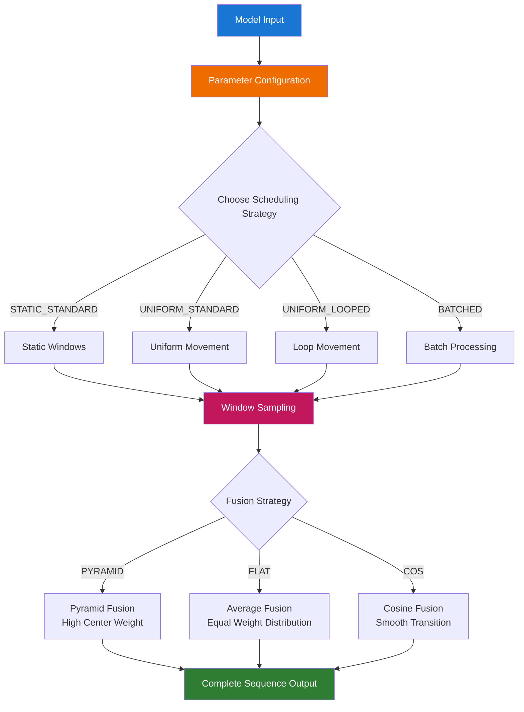
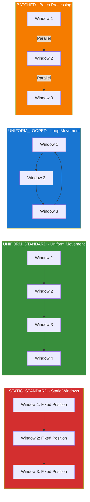
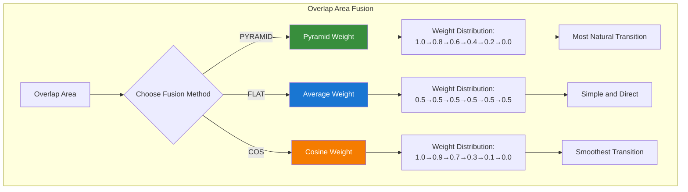

The `Context Windows (Manual)` node provides complete manual control over context windows. It decomposes long sequences into multiple overlapping context windows for sampling, rather than processing the entire sequence at once, thereby effectively managing memory usage and enabling high-quality long sequence generation.

```mermaid
%%{init: {"theme": "base", "themeVariables": {"primaryColor": "#444444", "primaryTextColor": "#ffffff", "primaryBorderColor": "#cccccc", "lineColor": "transparent", "sectionBkgColor": "#f8f9fa", "altSectionBkgColor": "#e9ecef", "gridColor": "transparent", "section0": "#555555", "section1": "#777777", "section2": "#E6F3FF", "section3": "#bbbbbb", "activeTaskBkgColor": "#444444", "activeTaskBorderColor": "#cccccc", "cScale0": "#555555", "cScale1": "#777777", "cScale2": "#E6F3FF", "critBkgColor": "#E6F3FF", "critBorderColor": "#B3D9FF", "xyColor": "#333333", "axisTextColor": "#333333", "gridLineColor": "transparent"}}}%%
gantt
    title Context Window Processing Example (length=21, overlap=5)
    dateFormat X
    axisFormat %s
    
    section Original Sequence
    Complete Content (length=81) : 0, 81
    
    section Window Processing
    Window 1 (0-20) : active, w1, 0, 21
    Window 2 (16-36) : active, w2, 16, 37
    Window 3 (32-52) : active, w3, 32, 53
    Window 4 (48-68) : active, w4, 48, 69
    Window 5 (64-81) : active, w5, 64, 81
    
    section Overlap Areas
    Overlap 1-2 : crit, o1, 16, 21
    Overlap 2-3 : crit, o2, 32, 37
    Overlap 3-4 : crit, o3, 48, 53
    Overlap 4-5 : crit, o4, 64, 69
```

## Input Parameters

| Parameter Name | Function | Detailed Description |
|----------------|----------|----------------------|
| `model` | Model Input | Base model object that requires context window processing |
| `context_length` | Window Length Control | Length of each context window. Larger values provide broader processing range but require more memory |
| `context_overlap` | Window Overlap Setting | Size of overlapping area between adjacent windows, ensuring content coherence. More overlap provides smoother results but increases processing time |
| `context_schedule` | Scheduling Strategy | Controls how windows move and arrange across the sequence, including static, uniform, looped, and batched modes |
| `context_stride` | Movement Step Size | Step size for window movement, only effective in UNIFORM scheduling mode, controls fine-grained window movement |
| `closed_loop` | Loop Mode Switch | Whether to connect the last window with the first to form a loop, only effective in LOOPED scheduling mode |
| `fuse_method` | Fusion Method | Algorithm for merging overlap areas, affects smoothness of window transitions and final results |
| `dim` | Application Dimension | Specifies which data dimension to apply context window processing, typically 0 (time dimension) |

## Context Scheduling Strategies

| Scheduling Strategy | Working Method | Best Use Cases |
|--------------------|--------------|--------------| 
| **STATIC_STANDARD** | Fixed window positions | Processing fixed region content, tasks requiring precise position control |
| **UNIFORM_STANDARD** | Windows move uniformly by set step size | Continuous processing of long sequences, such as long text or long video sequences |
| **UNIFORM_LOOPED** | Uniform movement with head-to-tail connection | Cyclic content processing, such as background music or repetitive pattern generation |
| **BATCHED** | Multiple windows processed in parallel batches | Efficient processing of large amounts of data, suitable for sufficient memory situations |

## Fusion Methods

| Fusion Method | Weight Distribution | Effect Characteristics |
|--------------|--------------------|-----------------------|
| **PYRAMID** | Highest weight at center, decreasing toward edges | Most natural transition effect, recommended for most scenarios |
| **FLAT** | Equal weight distribution in overlap areas | Simple and direct fusion, suitable for uniform content |
| **COS** | Cosine curve-shaped weight distribution | Very smooth transition, suitable for content requiring gentle effects |

## Output Results

| Parameter Name | Description |
|---------------|-------------|
| `model` | Model object with applied context window processing, can be directly connected to samplers for generation |

## Node Principle

The `Context Windows (Manual)` decomposes long sequences into multiple overlapping windows for processing:

### Workflow Diagram

### Scheduling Strategy Comparison

### Fusion Method Comparison

### Simple Understanding

Like viewing a large painting through multiple small windows:
- Each window views a portion (window processing)
- Windows overlap to ensure coherence (overlap areas)
- Finally, all portions are stitched together into a complete image (result fusion)

## Recommended Settings

**Beginner Recommendation**: Keep default values (length: 16, overlap: 4)

**For Higher Quality**: Increase overlap value to 6-8

**For Processing Very Long Content**: Increase window length to 32-64

## Advantages and Limitations

**Advantages**:
- ✅ Saves memory usage
- ✅ Supports ultra-long sequence processing

**Notes**:
- ⚠️ Processing time will be slightly longer
- ⚠️ Requires more system memory

## Typical Usage

**Usage Steps**:
1. Load model
2. Connect to Context Windows Manual node
3. Connect to sampler to generate results

With the `Context Windows (Manual)` node, you can easily process ultra-long sequences without worrying about memory limitations.