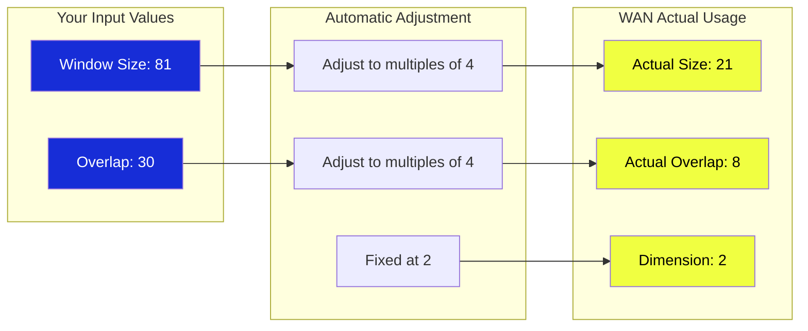

The `WAN Context Windows (Manual)` node is specifically designed for WAN models. It automatically adjusts parameters to allow WAN models to better handle long content.

**How it works:**
Like using multiple segmented samples to generate different segments of a video, and finally synthesizing a complete video**
- Each window looks at a part (window processing)
- Windows overlap to ensure coherence (overlap areas)
- Finally, all parts are spliced into a complete image (result fusion)

```mermaid
%%{init: {"theme": "base", "themeVariables": {"primaryColor": "#444444", "primaryTextColor": "#ffffff", "primaryBorderColor": "#cccccc", "lineColor": "transparent", "sectionBkgColor": "#f8f9fa", "altSectionBkgColor": "#e9ecef", "gridColor": "transparent", "section0": "#555555", "section1": "#777777", "section2": "#E6F3FF", "section3": "#bbbbbb", "activeTaskBkgColor": "#444444", "activeTaskBorderColor": "#cccccc", "cScale0": "#555555", "cScale1": "#777777", "cScale2": "#E6F3FF", "critBkgColor": "#E6F3FF", "critBorderColor": "#B3D9FF", "xyColor": "#333333", "axisTextColor": "#333333", "gridLineColor": "transparent"}}}%%
gantt
    title Context Window Processing Example (length=21, overlap=5)
    dateFormat X
    axisFormat %s
    
    section Original Sequence
    Complete Content (length=81) : 0, 81
    
    section Window Processing
    Window 1 (0-20) : active, w1, 0, 21
    Window 2 (16-36) : active, w2, 16, 37
    Window 3 (32-52) : active, w3, 32, 53
    Window 4 (48-68) : active, w4, 48, 69
    Window 5 (64-81) : active, w5, 64, 81
    
    section Overlap Areas
    Overlap 1-2 : crit, o1, 16, 21
    Overlap 2-3 : crit, o2, 32, 37
    Overlap 3-4 : crit, o3, 48, 53
    Overlap 4-5 : crit, o4, 64, 69
```



## Input Parameters

| Parameter Name | Function | Simple Explanation |
|---------------|----------|-------------------|
| `model` | WAN Model Input | The WAN model you want to process |
| `context_length` | Window Size | Length of each small window, WAN will automatically adjust to multiples of 4. The larger the range the more memory it occupies |
| `context_overlap` | Overlap Size | Overlapping part between windows, more overlap means smoother effect but slower processing |
| `context_schedule` | Processing Method | Choose how windows move, four modes available |
| `context_stride` | Movement Step | How much the window moves each time, only useful in uniform mode |
| `closed_loop` | Loop Mode | Whether to connect the last window back to the first, only useful in loop mode |
| `fuse_method` | Merge Method | Choose how overlapping parts merge, affects final effect |
| `dim` | Processing Dimension | Fixed at 2, specifically optimized for WAN models |

### Scheduling Strategy Selection

| Scheduling Strategy | Working Method |
|--------------------|----------------|
| **STATIC_STANDARD** | Window positions are fixed |
| **UNIFORM_STANDARD** | Windows move uniformly |
| **UNIFORM_LOOPED** | Windows move in a loop |
| **BATCHED** | Multiple windows processed simultaneously |

### Merge Methods

| Merge Method | Weight Distribution Method | Characteristics |
|-------------|---------------------------|-----------------|
| **PYRAMID** | Middle part most important, decreasing toward edges | Most natural effect, recommended |
| **RELATIVE** | Intelligent weight adjustment | Automatically adjusts based on position, natural effect |
| **FLAT** | Average weight distribution | Simple and direct, suitable for uniform content |
| **OVERLAP_LINEAR** | Linear gradient | Smoother transition |

## Output Results

| Parameter Name | Data Type | Description |
|---------------|-----------|-------------|
| `model` | MODEL | Processed WAN model, can be directly connected to sampler for use |


### WAN Parameter Automatic Adjustment



## Typical Usage

```mermaid
graph LR
    A[Model Loader (WAN Model)] --> B[WAN Context Windows Manual]
    B --> C[KSampler]
    C --> D[Final Output]
    
    style A fill:#172DD7,color:#ffffff
    style B fill:#E8F234,color:#000000
    style C fill:#2E41E7,color:#ffffff
    style D fill:#F0FF41,color:#000000
```

**Usage Steps**:
1. Load WAN model
2. Connect to WAN Context Windows Manual node  
3. Connect to sampler to generate results