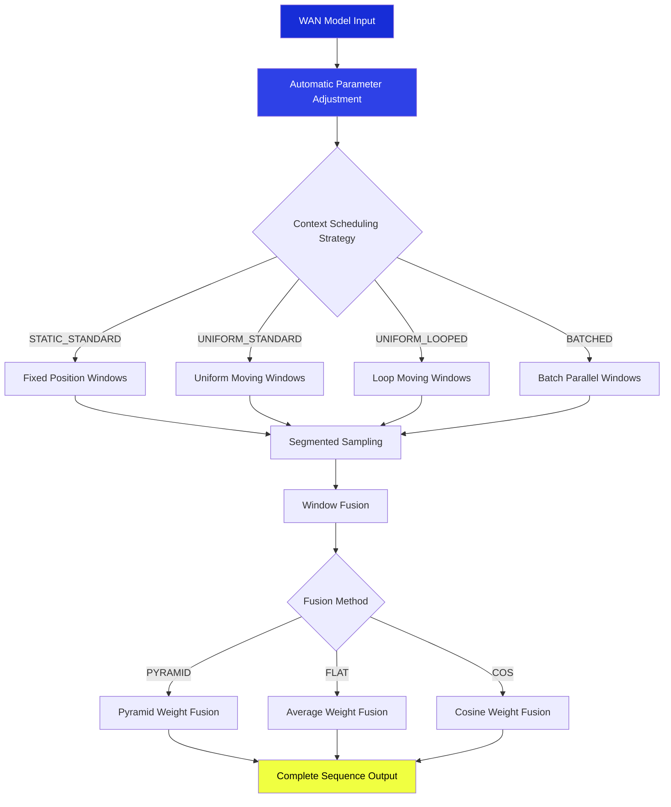
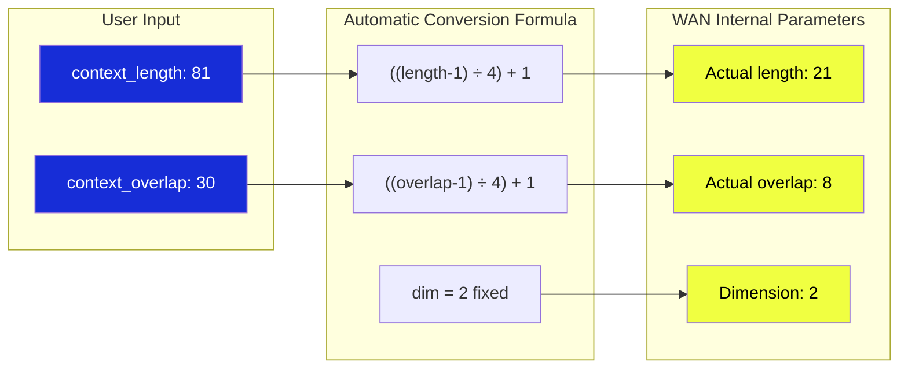
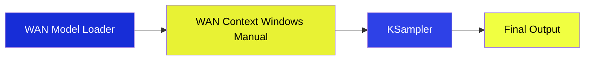

The `WAN Context Windows (Manual)` node is a context window controller specifically designed for WAN (Wide Attention Network) models. It automatically converts user-friendly context parameters to the internal format required by WAN models, implementing efficient sliding window sampling that is particularly suitable for long sequence generation tasks.

```mermaid
%%{init: {"theme": "base", "themeVariables": {"primaryColor": "#444444", "primaryTextColor": "#ffffff", "primaryBorderColor": "#cccccc", "lineColor": "transparent", "sectionBkgColor": "#f8f9fa", "altSectionBkgColor": "#e9ecef", "gridColor": "transparent", "section0": "#555555", "section1": "#777777", "section2": "#E6F3FF", "section3": "#bbbbbb", "activeTaskBkgColor": "#444444", "activeTaskBorderColor": "#cccccc", "cScale0": "#555555", "cScale1": "#777777", "cScale2": "#E6F3FF", "critBkgColor": "#E6F3FF", "critBorderColor": "#B3D9FF", "xyColor": "#333333", "axisTextColor": "#333333", "gridLineColor": "transparent"}}}%%
gantt
    title WAN Context Window Processing Example (length=21, overlap=8)
    dateFormat X
    axisFormat %s
    
    section Original Sequence
    Complete Content (length=100) : 0, 81
    
    section Window Division
    Window 1 (0-20) : active, window1, 0, 21
    Window 2 (13-33) : active, window2, 13, 34
    Window 3 (26-46) : active, window3, 26, 47
    Window 4 (39-59) : active, window4, 39, 60
    
    section Overlap Areas
    Overlap 1-2 : crit, overlap1, 13, 21
    Overlap 2-3 : crit, overlap2, 26, 34
    Overlap 3-4 : crit, overlap3, 39, 47
```

## Input Parameters Details

| Parameter Name | Function | Detailed Description |
|---------------|----------|----------------------|
| `model` | WAN Model Input | WAN model object that requires context window processing |
| `context_length` | Window Length Control | Length of each context window. WAN models automatically adjust to multiples of 4. Larger values provide broader processing range but higher memory usage |
| `context_overlap` | Window Overlap Setting | Size of overlapping area between adjacent windows, ensuring content coherence between windows. More overlap provides smoother results but longer processing time |
| `context_schedule` | Scheduling Strategy Selection | Controls how windows move and arrange across the sequence, including static, uniform, looped, and batched modes |
| `context_stride` | Movement Step Size | Step size for window movement, only effective in UNIFORM scheduling mode, controls fine-grained window movement |
| `closed_loop` | Loop Mode Switch | Whether to connect the last window with the first to form a loop, only effective in LOOPED scheduling mode |
| `fuse_method` | Fusion Method | Algorithm for merging overlap areas, affects smoothness of window transitions and final results |

### Context Scheduling Strategy Details

| Scheduling Strategy | Working Method | Best Use Cases |
|--------------------|---------------|----------------|
| **STATIC_STANDARD** | Fixed window positions | Processing fixed region content, tasks requiring precise position control |
| **UNIFORM_STANDARD** | Windows move uniformly by set step size | Continuous processing of long sequences, such as long text or long video sequences |
| **UNIFORM_LOOPED** | Uniform movement with head-to-tail connection | Cyclic content processing, such as background music or repetitive pattern generation |
| **BATCHED** | Multiple windows processed in parallel batches | Efficient processing of large amounts of data, suitable for sufficient memory situations |

### Fusion Method Details

| Fusion Method | Weight Distribution | Effect Characteristics |
|--------------|--------------------|-----------------------|
| **PYRAMID** | Highest weight at center, decreasing toward edges | Most natural transition effect, recommended for most scenarios |
| **FLAT** | Equal weight distribution in overlap areas | Simple and direct fusion, suitable for uniform content |
| **COS** | Cosine curve-shaped weight distribution | Very smooth transition, suitable for content requiring gentle effects |

## Output Results

| Parameter Name | Data Type | Description |
|---------------|-----------|-------------|
| `model` | MODEL | WAN model object with applied context window processing |

## Node Principle: Cinematic Shot Division Strategy

Imagine you need to shoot an ultra-long panoramic movie, but the camera's field of view is limited. The `WAN Context Windows (Manual)` is like a **professional shot division director**:

### Workflow Diagram

### WAN Automatic Parameter Conversion

### Simple Understanding

The `WAN Context Windows (Manual)` is like using multiple small lenses to shoot a long movie:
- Each lens captures a small segment of content (window processing)
- Lenses overlap to ensure continuity (window overlap)
- Finally, all shots are intelligently stitched into a complete film (fusion output)

## Recommended Configuration

**Beginner Recommendation**: Keep default values (length: 81, overlap: 30)

**For Higher Quality**: Increase overlap value to 40-50

**For Processing Ultra-Long Content**: Increase window length to 100-150

## Performance and Limitations

### Advantages
- ✅ **Memory-Friendly**: Segmented processing avoids large memory requirements
- ✅ **WAN Optimized**: Specifically tuned for WAN models
- ✅ **Automatic Parameter Adjustment**: No need for manual calculation and conversion
- ✅ **Multiple Strategies**: Flexible scheduling and fusion options

### Considerations
- ⚠️ Processing time will be slightly longer than standard methods
- ⚠️ Requires more memory to store window information

## Typical Usage

**Usage Steps**:
1. Load WAN model
2. Connect to WAN Context Windows Manual node
3. Connect to sampler to generate results

With the `WAN Context Windows (Manual)` node, you can easily handle long sequence generation tasks without worrying about memory limitations.