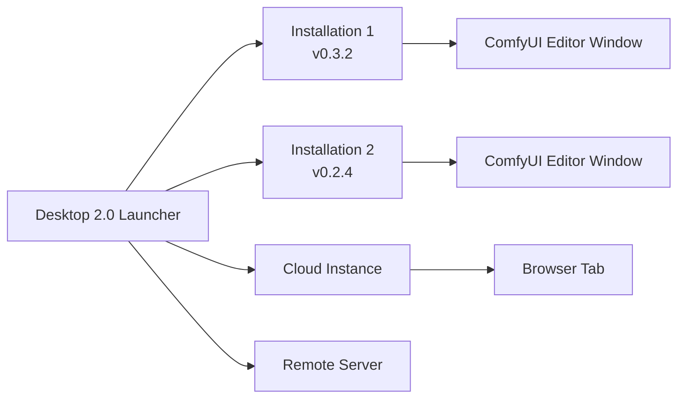

**ComfyUI Desktop 2.0** is a next-generation desktop application that lets you install, manage, and launch multiple ComfyUI instances from a single place. Unlike the original Desktop (single-install), Desktop 2.0 is a multi-installation manager — think of it as a launcher for all your ComfyUI environments.

## Key Features

### Multi-Installation Management

Desktop 2.0 supports several types of ComfyUI installations:

| Source Type | Description |
|-------------|-------------|
| **Standalone** | A self-contained install with its own bundled Python and dependencies — clean, isolated, and easy to manage |
| **Cloud** | Connect to Comfy Cloud for remote GPU-powered workflows |
| **Git Clone** | Track an existing ComfyUI git clone with a Python venv — ideal for developers |
| **Portable** | Import existing ComfyUI portable installations (Windows) |
| **Legacy Desktop** | Detect and migrate existing Desktop 1.0 installations |
| **Remote Connection** | Connect to a running ComfyUI instance on another machine |

### What You Can Do

- **Quick Install** — Install a fresh standalone ComfyUI with one click, with automatic Python environment setup
- **Run Multiple Instances** — Launch and switch between different ComfyUI versions side by side
- **Snapshots** — Automatic snapshots capture your custom nodes, models, and settings before every update; restore to any previous snapshot at any time
- **One-Click Updates** — Update ComfyUI installations with a single click
- **Model Downloads** — Built-in model download manager with progress tracking
- **In-App Terminal** — Access the ComfyUI Python environment directly from the app
- **Global Settings** — Configure themes, proxy mirrors for China users, and anonymous usage metrics

## How It Works

Desktop 2.0 separates the **launcher** from the **workflow editor**. The app manages your installations; each installation runs its own ComfyUI backend (with its own Python environment). When you launch an installation, it opens in a separate window with the full ComfyUI workflow editor.

## System Requirements

### Windows
- **OS:** Windows 10 or later
- **GPU:** NVIDIA GPU with CUDA support
- **Architecture:** x64 or ARM64

### macOS
- **OS:** macOS 13 (Ventura) or later
- **Hardware:** Apple Silicon (M1 or later)

### Linux
- **OS:** Ubuntu 22.04+ (Debian-based distributions)
- **GPU:** NVIDIA GPU with CUDA support (recommended)

### General
- **Disk Space:** At least 15 GB for each standalone installation
- **RAM:** 8 GB minimum, 16 GB recommended
- **Internet:** Required for installation and updates

## Desktop 2.0 vs Desktop 1.0

| Feature | Desktop 1.0 | Desktop 2.0 |
|---------|-------------|-------------|
| Installation type | Single ComfyUI instance | Multi-installation manager |
| Python management | Bundled single env | Per-instance isolated Python environments |
| Snapshots | Not available | Automatic snapshots before updates |
| Cloud support | No | Native Comfy Cloud integration |
| Multiple versions | No | Run different versions side by side |
| Git clone support | No | Yes |
| Remote connection | No | Yes |

## Open Source

ComfyUI Desktop 2.0 is fully open source. View the source code on [GitHub](https://github.com/Comfy-Org/ComfyUI-Desktop-2.0-Beta).

## Getting Started

Ready to get started? Choose your platform:

- [Windows Installation](/installation/desktop-2/windows)
- [macOS Installation](/installation/desktop-2/macos)
- [Linux Installation](/installation/desktop-2/linux)
