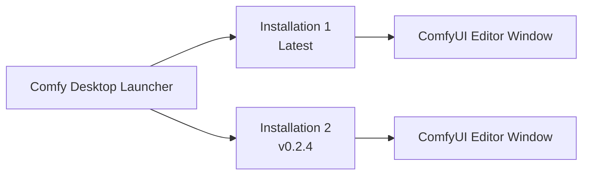

**Comfy Desktop** is a next-generation desktop application that lets you install, manage, and launch multiple ComfyUI instances from a single place. Unlike the original Desktop (single-install), Comfy Desktop is a multi-installation manager — think of it as a launcher for all your ComfyUI environments.

## Key Features

<CardGroup cols={2}>
  <Card title="Multiple Installs, Side by Side" icon="layer-group">
    Run as many independent ComfyUI setups as you like, each with its own version, models, and custom nodes. Switch between them without conflicts.
  </Card>

  <Card title="Isolated, GPU-Ready Environments" icon="microchip">
    Each install ships a relocatable Python with PyTorch and GPU wheels prebuilt. No pip/uv failures, no CUDA roulette at install time.
  </Card>

  <Card title="One-Click Updates" icon="arrows-rotate">
    Update ComfyUI (and custom nodes) to the latest version in place. No terminal, no git, no re-downloading the multi-gigabyte environment.
  </Card>

  <Card title="Snapshots & Rollback" icon="camera">
    Back up an install and restore it if an update or a custom node breaks something.
  </Card>

  <Card title="Bring Your Existing Setup" icon="folder-open">
    Adopt and migrate existing ComfyUI installations (portable, git, or a previous desktop install) in place.
  </Card>

  <Card title="Built-in Auto-Updates" icon="rotate">
    The app keeps itself current — no need to manually check for new versions.
  </Card>
</CardGroup>

## How It Works

Comfy Desktop separates the **launcher** from the **workflow editor**. The app manages your installations; each installation runs its own ComfyUI backend (with its own Python environment). When you launch an installation, it opens in a separate window with the full ComfyUI workflow editor.

## System Requirements

<CardGroup cols={3}>
  <Card title="Windows" icon="windows">
    - **OS:** Windows 10 or later
    - **Arch:** x64 or ARM64
    - **GPU:** Dedicated GPU (NVIDIA / AMD) recommended for good performance, but not required
  </Card>

  <Card title="macOS" icon="app-store">
    - **OS:** macOS 13 (Ventura) or later
    - **Hardware:** Apple Silicon (M1 or later)
  </Card>

  <Card title="Linux" icon="linux">
    - **OS:** Debian-based (Ubuntu 22.04+ recommended)
    - **GPU:** Dedicated GPU (NVIDIA / AMD) recommended for good performance, but not required
  </Card>
</CardGroup>

### General Requirements
- **Disk Space:** At least 4.85 GB for each standalone installation
- **RAM:** 8 GB minimum, 16 GB recommended
- **Internet:** Required for installation and updates

## Open Source

Comfy Desktop is fully open source. View the source code on [GitHub](https://github.com/Comfy-Org/Comfy-Desktop).

## Get Started

Choose your platform to begin:

<CardGroup cols={3}>
  <Card title="Windows" icon="windows" href="/installation/desktop/windows">
    Step-by-step guide for installing Comfy Desktop on Windows 10 or later.
  </Card>

  <Card title="macOS" icon="app-store" href="/installation/desktop/macos">
    Step-by-step guide for installing Comfy Desktop on macOS 13+ (Apple Silicon).
  </Card>

  <Card title="Linux" icon="linux" href="/installation/desktop/linux">
    Step-by-step guide for installing Comfy Desktop on Debian-based distributions.
  </Card>
</CardGroup>

### Upgrading from Desktop Legacy?

If you're using the original Desktop (Legacy), check out the [Migration Guide](/installation/desktop/migrate-from-legacy) to learn how to migrate your installations.
