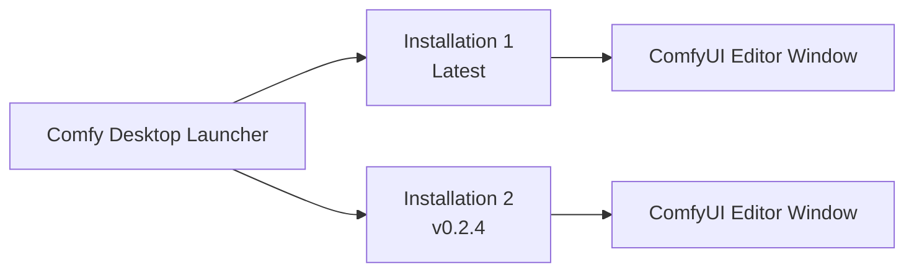

**Comfy Desktop** is a desktop application that lets you install, manage, and launch multiple ComfyUI instances from a single launcher.

## How It Works

Comfy Desktop separates the **launcher** from the **workflow editor**. Each installation runs its own ComfyUI backend with its own Python environment, custom nodes, and settings. When you launch one, it opens in its own window with the full ComfyUI editor.

## System Requirements

<CardGroup cols={3}>
  <Card title="Windows" icon="windows">
    - **OS:** Windows 10 or later
    - **Arch:** x64 or ARM64
    - **GPU:** Dedicated GPU recommended for good performance, but not required
  </Card>

  <Card title="macOS" icon="app-store">
    - **OS:** macOS 13 (Ventura) or later
    - **Hardware:** Apple Silicon (M1 or later)
  </Card>

  <Card title="Linux" icon="linux">
    - **OS:** Debian-based (Ubuntu 22.04+ recommended)
    - **GPU:** Dedicated GPU recommended for good performance, but not required
  </Card>
</CardGroup>

- **Disk Space:** At least 4.85 GB for each standalone installation
- **RAM:** 8 GB minimum, 16 GB recommended
- **Internet:** Required for installation and updates

## Get Started

Choose your platform to begin:

<CardGroup cols={3}>
  <Card title="Windows" icon="windows" href="/installation/desktop/windows">
    Step-by-step installation guide for Windows 10 or later.
  </Card>

  <Card title="macOS" icon="app-store" href="/installation/desktop/macos">
    Step-by-step installation guide for macOS 13+ (Apple Silicon).
  </Card>

  <Card title="Linux" icon="linux" href="/installation/desktop/linux">
    Build and install from source on Debian-based distributions.
  </Card>
</CardGroup>

## Usage Guide

Once installed, learn how to use Comfy Desktop:

<CardGroup cols={2}>
  <Card title="Instance Management" icon="plus" href="/installation/desktop/usage/instance-management">
    Create, rename, edit, and delete ComfyUI instances.
  </Card>
  <Card title="Managing Installations" icon="sliders" href="/installation/desktop/usage/manage">
    Launch, update, snapshot, and configure your installations.
  </Card>
  <Card title="Settings" icon="settings" href="/installation/desktop/usage/settings">
    Global settings, proxy/mirror, shortcuts, and data locations.
  </Card>
  <Card title="Migrate from Legacy" icon="arrow-right" href="/installation/desktop/usage/migrate">
    Upgrade from Desktop Legacy — your custom nodes and workflows are carried over.
  </Card>
</CardGroup>

## Open Source

Comfy Desktop is fully open source. View the source code on [GitHub](https://github.com/Comfy-Org/Comfy-Desktop).
