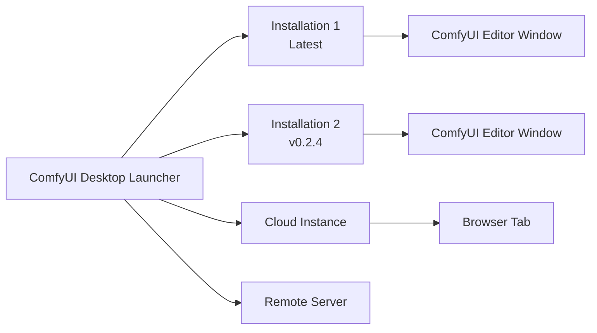

**ComfyUI Desktop** is a next-generation desktop application that lets you install, manage, and launch multiple ComfyUI instances from a single place. Unlike the original Desktop (single-install), ComfyUI Desktop is a multi-installation manager — think of it as a launcher for all your ComfyUI environments.

## Key Features

<CardGroup cols={2}>
  <Card title="Multi-Installation Management" icon="layer-group">
    Manage multiple ComfyUI versions side by side. Supports **Standalone** (bundled Python), **Cloud**, **Git Clone**, **Portable** (Windows), and **Remote Connection**.
  </Card>

  <Card title="Quick Install" icon="bolt">
    Install a fresh standalone ComfyUI with one click — automatic Python environment setup included.
  </Card>

  <Card title="Snapshots & Restore" icon="camera">
    Automatic snapshots capture your custom nodes, models, and settings before every update. Restore any previous state anytime.
  </Card>

  <Card title="One-Click Updates" icon="arrows-rotate">
    Keep your ComfyUI installations up to date with a single click.
  </Card>

  <Card title="Model Downloads" icon="download">
    Built-in model download manager with progress tracking.
  </Card>

  <Card title="In-App Terminal" icon="terminal">
    Access the ComfyUI Python environment directly from the app.
  </Card>
</CardGroup>

## How It Works

ComfyUI Desktop separates the **launcher** from the **workflow editor**. The app manages your installations; each installation runs its own ComfyUI backend (with its own Python environment). When you launch an installation, it opens in a separate window with the full ComfyUI workflow editor.

## System Requirements

<CardGroup cols={3}>
  <Card title="Windows" icon="windows">
    - **OS:** Windows 10 or later
    - **GPU:** NVIDIA GPU with CUDA support
    - **Arch:** x64 or ARM64
  </Card>

  <Card title="macOS" icon="apple">
    - **OS:** macOS 13 (Ventura) or later
    - **Hardware:** Apple Silicon (M1 or later)
  </Card>

  <Card title="Linux" icon="linux">
    - **OS:** Ubuntu 22.04+ (Debian-based)
    - **GPU:** NVIDIA GPU with CUDA (recommended)
  </Card>
</CardGroup>

### General Requirements
- **Disk Space:** At least 15 GB for each standalone installation
- **RAM:** 8 GB minimum, 16 GB recommended
- **Internet:** Required for installation and updates

## Open Source

ComfyUI Desktop is fully open source. View the source code on [GitHub](https://github.com/Comfy-Org/Comfy-Desktop).

## Get Started

Choose your platform to begin:

<CardGroup cols={3}>
  <Card title="Windows" icon="windows" href="/installation/desktop/windows">
    Step-by-step guide for installing ComfyUI Desktop on Windows 10 or later.
  </Card>

  <Card title="macOS" icon="apple" href="/installation/desktop/macos">
    Step-by-step guide for installing ComfyUI Desktop on macOS 13+ (Apple Silicon).
  </Card>

  <Card title="Linux" icon="linux" href="/installation/desktop/linux">
    Step-by-step guide for installing ComfyUI Desktop on Ubuntu 22.04+.
  </Card>
</CardGroup>

### Upgrading from Desktop Legacy?

If you're using the original Desktop (Legacy), check out the [Migration Guide](/installation/desktop/migrate-from-legacy) to learn how to migrate your installations.
