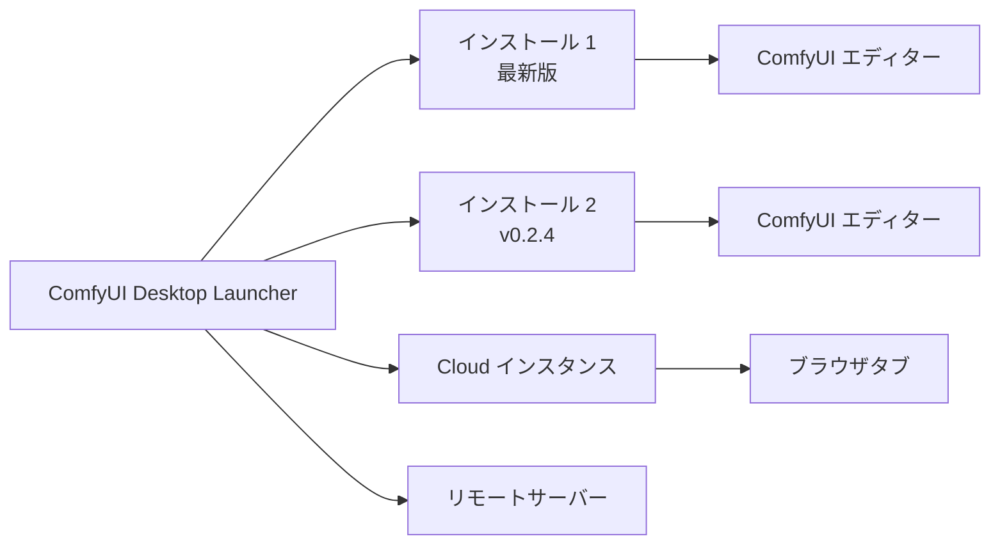

**ComfyUI Desktop** は、一箇所から複数の ComfyUI インスタンスをインストール、管理、起動できる次世代デスクトップアプリケーションです。従来の Desktop（シングルインストール）とは異なり、ComfyUI Desktop はマルチインストレーションマネージャーです。

## 主な機能

<CardGroup cols={2}>
  <Card title="マルチインストール管理" icon="layer-group">
    複数の ComfyUI バージョンを同時に管理。**Standalone**（Python バンドル）、**Cloud**、**Git Clone**、**Portable**（Windows）、**リモート接続**をサポート。
  </Card>

  <Card title="クイックインストール" icon="bolt">
    ワンクリックで新しい ComfyUI をインストール、Python 環境を自動設定。
  </Card>

  <Card title="スナップショットと復元" icon="camera">
    更新前にカスタムノード、モデル、設定を自動保存。いつでも以前の状態に復元可能。
  </Card>

  <Card title="ワンクリックアップデート" icon="arrows-rotate">
    ワンクリックで ComfyUI インストールを常に最新に保ちます。
  </Card>

  <Card title="モデルダウンロード" icon="download">
    内蔵モデルダウンロードマネージャー、進捗状況を表示。
  </Card>

</CardGroup>

## 動作の仕組み

ComfyUI Desktop は**ランチャー**と**ワークフローエディター**を分離しています。アプリがインストールを管理し、各インストールは独自の ComfyUI バックエンド（独自の Python 環境）を実行します。インストールを起動すると、別ウィンドウで完全な ComfyUI エディターが開きます。

## システム要件

<CardGroup cols={3}>
  <Card title="Windows" icon="windows">
    - **OS:** Windows 10 以降
    - **GPU:** CUDA 対応 NVIDIA GPU
    - **アーキテクチャ:** x64 または ARM64
  </Card>

  <Card title="macOS" icon="apple">
    - **OS:** macOS 13 (Ventura) 以降
    - **ハードウェア:** Apple Silicon（M1 以降）
  </Card>

  <Card title="Linux" icon="linux">
    - **OS:** Ubuntu 22.04+（Debian 系）
    - **GPU:** CUDA 対応 NVIDIA GPU（推奨）
  </Card>
</CardGroup>

### 共通要件
- **ディスク容量:** 各インストールにつき最低 15 GB
- **RAM:** 最低 8 GB、推奨 16 GB
- **インターネット:** インストールと更新に必要

## オープンソース

ComfyUI Desktop は完全にオープンソースです。[GitHub](https://github.com/Comfy-Org/Comfy-Desktop) でソースコードを閲覧できます。

## はじめに

プラットフォームを選択して開始してください：

<CardGroup cols={3}>
  <Card title="Windows" icon="windows" href="/ja/installation/desktop/windows">
    Windows 10 以降に ComfyUI Desktop をインストールする手順。
  </Card>

  <Card title="macOS" icon="apple" href="/ja/installation/desktop/macos">
    macOS 13+（Apple Silicon）に ComfyUI Desktop をインストールする手順。
  </Card>

  <Card title="Linux" icon="linux" href="/ja/installation/desktop/linux">
    Ubuntu 22.04+ に ComfyUI Desktop をインストールする手順。
  </Card>
</CardGroup>

### Desktop Legacy からアップグレードする場合

旧バージョンの Desktop Legacy を使用している場合は、[移行ガイド](/ja/installation/desktop/migrate-from-legacy)を参照してください。
