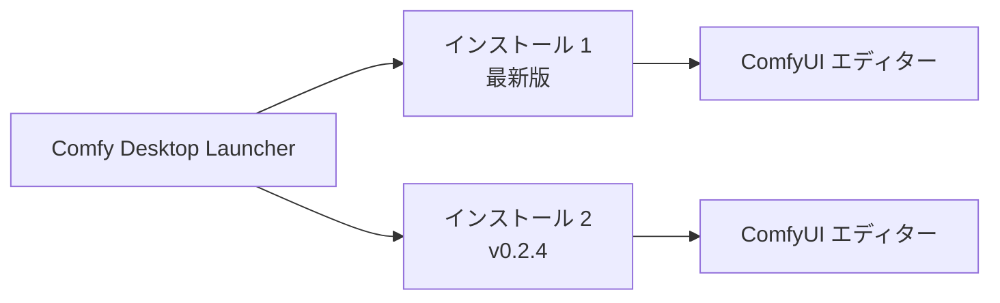

**Comfy Desktop** は、一箇所から複数の ComfyUI インスタンスをインストール、管理、起動できる次世代デスクトップアプリケーションです。従来の Desktop（シングルインストール）とは異なり、Comfy Desktop はマルチインストレーションマネージャーです。

## 主な機能

<CardGroup cols={2}>
  <Card title="複数インストールを並行実行" icon="layer-group">
    独立した ComfyUI 環境をいくつでも実行可能。それぞれが独自のバージョン、モデル、カスタムノードを持ち、切り替えても競合しません。
  </Card>

  <Card title="分離された GPU 対応環境" icon="microchip">
    各インストールは再配置可能な Python と PyTorch、GPU ホイールを内蔵。インストール時の pip 失敗や CUDA の問題がありません。
  </Card>

  <Card title="ワンクリックアップデート" icon="arrows-rotate">
    ComfyUI（およびカスタムノード）をその場で最新版に更新。ターミナルも Git も再ダウンロードも不要。
  </Card>

  <Card title="スナップショットとロールバック" icon="camera">
    インストールをバックアップし、更新やカスタムノードで問題が発生した場合に復元できます。
  </Card>

  <Card title="既存セットアップをインポート" icon="folder-open">
    既存の ComfyUI インストール（ポータブル、Git、旧 Desktop）をその場で移行できます。
  </Card>

  <Card title="内蔵自動アップデート" icon="rotate">
    アプリ自身が自動更新されるため、新しいバージョンを手動で確認する必要はありません。
  </Card>
</CardGroup>

## 動作の仕組み

Comfy Desktop は**ランチャー**と**ワークフローエディター**を分離しています。アプリがインストールを管理し、各インストールは独自の ComfyUI バックエンド（独自の Python 環境）を実行します。インストールを起動すると、別ウィンドウで完全な ComfyUI エディターが開きます。

## システム要件

<CardGroup cols={3}>
  <Card title="Windows" icon="windows">
    - **OS:** Windows 10 以降
    - **アーキテクチャ:** x64 または ARM64
    - **GPU:** 専用 GPU（NVIDIA / AMD）を推奨しますが、必須ではありません
  </Card>

  <Card title="macOS" icon="apple">
    - **OS:** macOS 13 (Ventura) 以降
    - **ハードウェア:** Apple Silicon（M1 以降）
  </Card>

  <Card title="Linux" icon="linux">
    - **OS:** Debian 系（Ubuntu 22.04+ 推奨）
    - **GPU:** 専用 GPU（NVIDIA / AMD）を推奨しますが、必須ではありません
  </Card>
</CardGroup>

### 共通要件
- **ディスク容量:** 各インストールにつき最低 15 GB
- **RAM:** 最低 8 GB、推奨 16 GB
- **インターネット:** インストールと更新に必要

## オープンソース

Comfy Desktop は完全にオープンソースです。[GitHub](https://github.com/Comfy-Org/Comfy-Desktop) でソースコードを閲覧できます。

## はじめに

プラットフォームを選択して開始してください：

<CardGroup cols={3}>
  <Card title="Windows" icon="windows" href="/ja/installation/desktop/windows">
    Windows 10 以降に Comfy Desktop をインストールする手順。
  </Card>

  <Card title="macOS" icon="apple" href="/ja/installation/desktop/macos">
    macOS 13+（Apple Silicon）に Comfy Desktop をインストールする手順。
  </Card>

  <Card title="Linux" icon="linux" href="/ja/installation/desktop/linux">
    Ubuntu 22.04+ に Comfy Desktop をインストールする手順。
  </Card>
</CardGroup>

### Desktop Legacy からアップグレードする場合

旧バージョンの Desktop Legacy を使用している場合は、[移行ガイド](/ja/installation/desktop/migrate-from-legacy)を参照してください。
