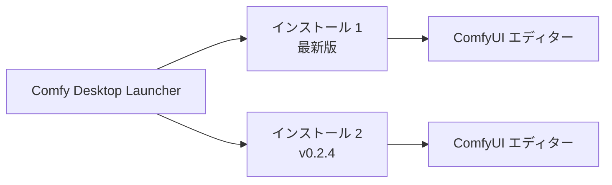

**Comfy Desktop** は、一つのランチャーから複数の ComfyUI インスタンスをインストール、管理、起動できるデスクトップアプリケーションです。

## 動作の仕組み

Comfy Desktop は**ランチャー**と**ワークフローエディター**を分離しています。各インストールは独自の Python 環境、カスタムノード、設定を持ち、独立した ComfyUI バックエンドを実行します。インストールを起動すると、別ウィンドウで完全な ComfyUI エディターが開きます。

## システム要件

<CardGroup cols={3}>
  <Card title="Windows" icon="windows">
    - **OS:** Windows 10 以降
    - **アーキテクチャ:** x64 または ARM64
    - **GPU:** 専用 GPU を推奨しますが、必須ではありません
  </Card>

  <Card title="macOS" icon="app-store">
    - **OS:** macOS 13 (Ventura) 以降
    - **ハードウェア:** Apple Silicon（M1 以降）
  </Card>

  <Card title="Linux" icon="linux">
    - **OS:** Debian 系（Ubuntu 22.04+ 推奨）
    - **GPU:** 専用 GPU を推奨しますが、必須ではありません
  </Card>
</CardGroup>

- **ディスク容量:** 各インストールにつき最低 4.85 GB
- **RAM:** 最低 8 GB、推奨 16 GB
- **インターネット:** インストールと更新に必要

## はじめに

プラットフォームを選択して開始してください：

<CardGroup cols={3}>
  <Card title="Windows" icon="windows" href="/ja/installation/desktop/windows">
    Windows 10 以降のインストール手順。
  </Card>

  <Card title="macOS" icon="app-store" href="/ja/installation/desktop/macos">
    macOS 13+（Apple Silicon）のインストール手順。
  </Card>

  <Card title="Linux" icon="linux" href="/ja/installation/desktop/linux">
    Debian 系ディストリビューションのインストール手順。
  </Card>
</CardGroup>

## 使い方ガイド

インストール後は、以下のガイドをご覧ください：

<CardGroup cols={2}>
  <Card title="インスタンス管理" icon="plus" href="/ja/installation/desktop/usage/instance-management">
    ComfyUI インスタンスの作成、名前変更、編集、削除。
  </Card>
  <Card title="インストール管理" icon="sliders" href="/ja/installation/desktop/usage/manage">
    起動、更新、スナップショット、設定。
  </Card>
  <Card title="設定" icon="settings" href="/ja/installation/desktop/usage/settings">
    グローバル設定、ミラー/プロキシ、ショートカット、データ保存場所。
  </Card>
  <Card title="レガシーから移行" icon="arrow-right" href="/ja/installation/desktop/usage/migrate">
    Desktop Legacy からアップグレード — カスタムノードとワークフローは引き継がれます。
  </Card>
</CardGroup>

## オープンソース

Comfy Desktop は完全にオープンソースです。[GitHub](https://github.com/Comfy-Org/Comfy-Desktop) でソースコードを閲覧できます。
