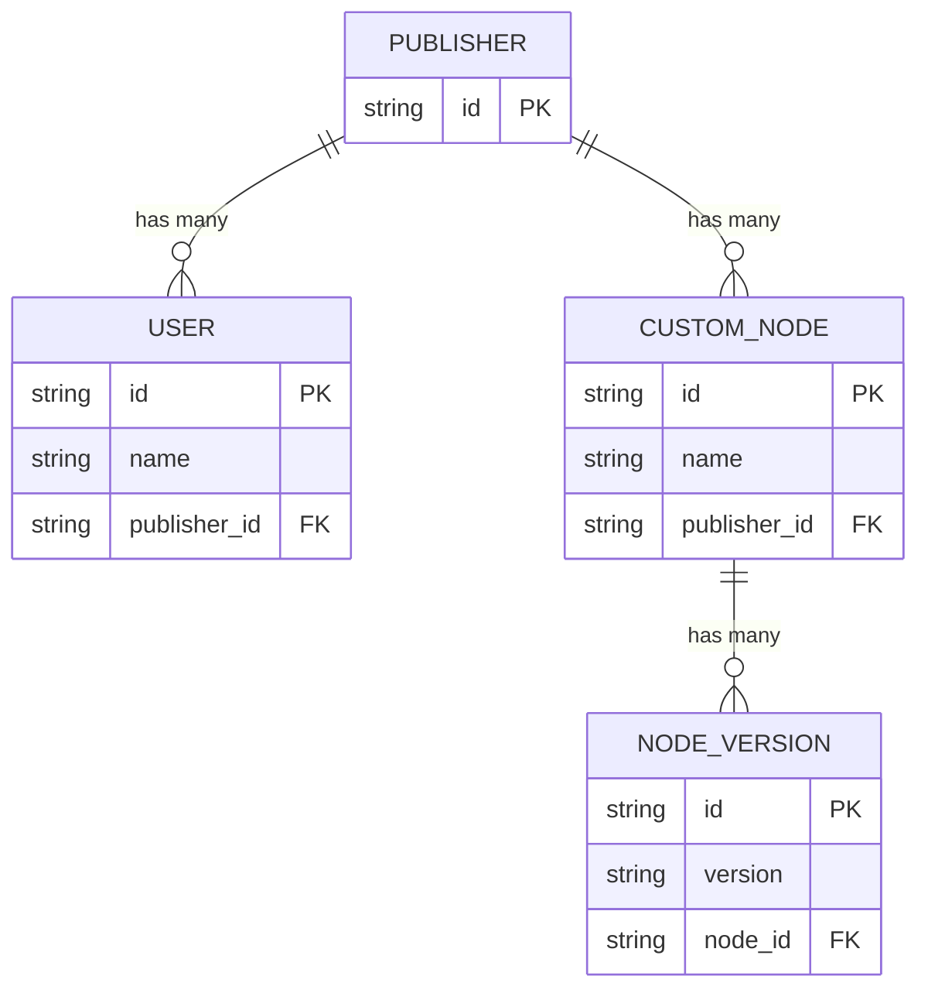

## 概要

カスタムノードレジストリは以下の構造に従います：

## よく利用される API

- **すべてのノードを一覧表示** [API](/registry/api-reference/nodes/retrieves-a-list-of-nodes)
- **ノードをインストール** [API](/registry/api-reference/nodes/returns-a-node-version-to-be-installed)