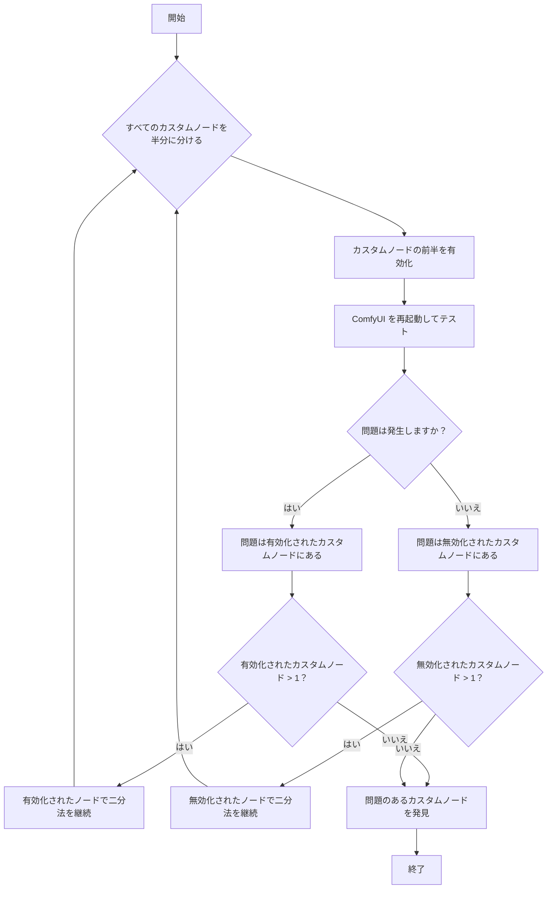

カスタムノードの問題をトラブルシューティングするための全体のアプローチは以下の通りです：

 ```mermaid
 flowchart TD
    A[問題が発生した] --> B{<a href="#how-to-disable-all-custom-nodes%3F">すべてのカスタムノードを無効化した後に問題は消えますか？</a>}
    B -- はい --> C[問題はカスタムノードが原因]
    B -- いいえ --> D[問題はカスタムノードが原因ではないため、他の<a href="/ja/troubleshooting/overview">トラブルシューティングドキュメント</a>を参照]
    C --> E{<a href="#1-troubleshooting-the-custom-nodes'-frontend-extensions">まずフロントエンド拡張機能をチェックしますか？</a>}
    E -- はい --> F[<a href="#1-troubleshooting-the-custom-nodes'-frontend-extensions">ComfyUI フロントエンドでトラブルシューティング</a><br/><li>フロントエンドの再読み込みのみ必要</li>]
    E -- いいえ --> G[<a href="#2-general-custom-node-troubleshooting">一般的な二分法を使用</a><li>ComfyUI の複数回の再起動が必要</li>]
    F --> H[二分法を使用して問題のあるノードを特定]
    G --> H
    H --> I[<a href="#how-to-fix-the-issue">問題のあるノードの修正、置換、報告、または削除</a>]
    I --> J[問題解決]
```

## すべてのカスタムノードを無効にするには？

<Tabs>
<Tab title="デスクトップ版">
設定メニューからカスタムノードを無効にして ComfyUI デスクトップを起動します

またはサーバーを手動で実行します：
```bash
cd path/to/your/comfyui
python main.py --disable-all-custom-nodes
```
</Tab>
<Tab title="手動インストール">
```bash
cd ComfyUI
python main.py --disable-all-custom-nodes
```
</Tab>
<Tab title="ポータブル版">
<Tabs>
   <Tab title="`.bat` ファイルの修正">
   ポータブル版があるフォルダを開き、`run_nvidia_gpu.bat` または `run_cpu.bat` ファイルを見つけます
   
   1. `run_nvidia_gpu.bat` または `run_cpu.bat` ファイルをコピーし、`run_nvidia_gpu_disable_custom_nodes.bat` に名前を変更します
   2. コピーしたファイルをメモ帳で開きます
   3. ファイルに `--disable-all-custom-nodes` パラメータを追加します。または、以下のパラメータを `.txt` ファイルにコピーして保存し、ファイル名を `run_nvidia_gpu_disable_custom_nodes.bat` に変更します
   ```bash
   .\python_embeded\python.exe -s ComfyUI\main.py --disable-all-custom-nodes  --windows-standalone-build
   pause
   ```
   4. ファイルを保存して閉じます
   5. ファイルをダブルクリックして実行します。すべて正常であれば、ComfyUI が起動し、カスタムノードが無効になっていることが確認できます
   </Tab>
   <Tab title="コマンドライン経由">
   
   1. ポータブル版があるフォルダに入ります
   2. 右クリックメニュー → ターミナルを開く でターミナルを開きます
   
   3. フォルダ名がポータブル版の現在のディレクトリであることを確認します
   4. 以下のコマンドを入力して、ポータブル版の python を経由して ComfyUI を起動し、カスタムノードを無効にします
   ```
   .\python_embeded\python.exe -s ComfyUI\main.py --disable-all-custom-nodes
   ```
   </Tab>
</Tabs>
</Tab>
</Tabs>

**結果：**
- ✅ **問題が消えた**: カスタムノードが問題の原因です → ステップ 2 に進みます
- ❌ **問題が継続する**: カスタムノードの問題ではありません → [問題を報告](#reporting-issues)

## 二分法とは？

このドキュメントでは、カスタムノードの問題をトラブルシューティングするための二分法アプローチを紹介します。これは、問題のあるノードを特定するまで、一度にカスタムノードの半分ずつをチェックする方法です。

具体的なアプローチについては以下のフローチャートを参照してください。毎回、現在無効になっているノードの半分を有効にし、問題が発生するか確認し、どのカスタムノードが問題の原因かを特定します


## 2 つのトラブルシューティング方法

このドキュメントでは、トラブルシューティングのためにカスタムノードを 2 つのタイプに分類します：


- A: フロントエンド拡張機能を持つカスタムノード
- B: 通常のカスタムノード

まず、不同类型的なカスタムノードで発生しうる問題と原因を理解しましょう：

<Tabs>
   <Tab title="フロントエンド拡張機能を持つカスタムノード">
   カスタムノードについては、フロントエンド拡張機能を持つものを優先的にトラブルシューティングできます。これらが最も多くの問題を引き起こすためです。主な競合は、ComfyUI フロントエンドのバージョン更新との非互換性から生じます。
   
   一般的な問題には以下が含まれます：
   - ワークフローが実行されない
   - 一部のノードがプレビュー画像を表示できない（保存画像ノードなど）
   - UI 要素の位置ずれ
   - ComfyUI フロントエンドにアクセスできない
   - UI が完全に壊れている、または空白の画面
   - ComfyUI バックエンドと正常に通信できない
   - ノード接続が正常に機能しない
   - その他
   
   これらの問題の一般的な原因：
   - 更新中にフロントエンドへの変更が行われたが、カスタムノードがまだ対応していない
   - 作者が互換性のあるバージョンをリリースしているにもかかわらず、ユーザーが ComfyUI を更新する際にカスタムノードを同期してアップグレードしていない
   - 作者がメンテナンスを停止し、カスタムノード拡張機能と ComfyUI フロントエンドの間に非互換性が生じている
      
   </Tab>
   <Tab title="通常のカスタムノード">
   問題がカスタムノードのフロントエンド拡張機能によって引き起こされていない場合、問題は依存関係に関連することが多いです。一般的な問題には以下が含まれます：
   - コンソール/ログに「Failed to import」（インポート失敗）エラーが表示される
   - 不足しているノードをインストールして再起動しても、不足として表示され続ける
   - ComfyUI がクラッシュする、または起動しない
   - その他

   これらのエラーの一般的な原因：
   - ComfyUI-Nunchaku のような追加の wheel が必要なカスタムノード
   - カスタムノードが厳密な依存関係バージョン（例：`torch==2.4.1`）を使用しているが、他のプラグインが異なるバージョン（例：`torch>=2.4.2`）を使用しており、インストール後に競合が発生する
   - ネットワークの問題により、依存関係のインストールが正常に完了しない

   問題が Python 環境の相互依存関係やバージョンに関わる場合、トラブルシューティングはより複雑になり、依存関係のインストールおよびアンインストール方法を含む Python 環境管理の知識が必要です
   </Tab>
</Tabs>

## トラブルシューティングのための二分法的使用

これら 2 つの不同类型的なカスタムノードの問題の中で、カスタムノードのフロントエンド拡張機能と ComfyUI の間の競合がより一般的です。これらのノードを優先的にトラブルシューティングします。以下が全体のトラブルシューティングアプローチです：

### 1. カスタムノードのフロントエンド拡張機能のトラブルシューティング

<Steps>
   <Step title="すべてのサードパーティ製フロントエンド拡張機能を無効にする">
   
   ComfyUI を起動した後、設定の `Extensions` メニューを見つけ、画像に示されている手順に従ってすべてのサードパーティ製拡張機能を無効にします
   <Tip>
      ComfyUI フロントエンドに入れない場合は、フロントエンド拡張機能のトラブルシューティングセクションをスキップし、[一般的なカスタムノードのトラブルシューティングアプローチ](#2-general-custom-node-troubleshooting) に進んでください
   </Tip>
   </Step>
   <Step title="ComfyUI を再起動する">
   最初にフロントエンド拡張機能を無効にした後、すべてのフロントエンド拡張機能が適切に無効化されていることを確認するために、ComfyUI を再起動することをお勧めします
   - 問題が消えた場合、それはカスタムノードのフロントエンド拡張機能が原因でした。二分法トラブルシューティングを進めることができます
   - 問題が継続する場合、それはフロントエンド拡張機能が原因ではありません。このドキュメントの他のトラブルシューティングアプローチを参照してください
   </Step>
   <Step title="二分法を使用して問題のあるノードを特定する">
   このドキュメントの冒頭で述べた方法を使用してトラブルシューティングを行い、問題のあるノードを見つけるまで、一度にカスタムノードの半分を有効にします
   
   画像を参照して、フロントエンド拡張機能の半分を有効にします。拡張機能の名前が似ている場合は、それらが同じカスタムノードのフロントエンド拡張機能から来ている可能性が高いことに注意してください
   </Step>
   <Step title="フォローアップアクション">
   問題のあるカスタムノードを見つけた場合は、このドキュメントの問題修正セクションを参照して、カスタムノードの問題を解決してください
   </Step>
</Steps>

この方法を使用すると、ComfyUI を複数回再起動する必要はありません。カスタムノードのフロントエンド拡張機能を有効/無効にした後に ComfyUI を再読み込みするだけです。さらに、トラブルシューティングの範囲はフロントエンド拡張機能を持つノードに限定されるため、検索範囲が大幅に狭まります。

### 2. 一般的なカスタムノードのトラブルシューティング


<Steps>
  <Step title="二分法を使用してカスタムノードを特定する">
      二分法ローカリゼーション方法については、手動検索に加えて、comfy-cli を使用した自動化された二分法もあります。詳細は以下の通りです：

      <Tabs>
         <Tab title="Comfy CLI の使用（推奨）">
         Comfy CLI の使用には、ある程度のコマンドラインの経験が必要です。慣れていない場合は、手動の二分法を使用してください。
         
         [Comfy CLI](/comfy-cli/getting-started) がインストールされている場合、自動化された bisect ツールを使用して問題のあるノードを見つけることができます：

         ```bash
         # bisect セッションを開始
         comfy-cli node bisect start

         # プロンプトに従います：
         # - 現在有効になっているノードセットで ComfyUI をテスト
         # - 問題が消えた場合は 'good' とマーク：comfy-cli node bisect good
         # - 問題が継続する場合は 'bad' とマーク：comfy-cli node bisect bad
         # - 問題のあるノードが特定されるまで繰り返す

         # 完了したらリセット
         comfy-cli node bisect reset
         ```

         bisect ツールは自動的にノードを有効/無効にし、プロセスをガイドします。

         </Tab>
         <Tab title="手動の二分法">
            <Warning>
            開始する前に、問題が発生した場合に備えて、custom_nodes フォルダの**バックアップを作成**してください。
            </Warning>

         手動でプロセスを実行するか、Comfy CLI がインストールされていない場合は、以下の手順に従ってください：

         <Steps>
            <Step title="一時フォルダを作成する">
            開始する前に、`<YOUR_COMFYUI_FOLDER>\ComfyUI\` フォルダに入ります
                  <Tabs>
                     <Tab title="Windows">
                     - **すべてのカスタムノードをバックアップ**: `custom_nodes` をコピーして `custom_nodes_backup` に名前を変更します
                     - **一時フォルダを作成**: `custom_nodes_temp` という名前のフォルダを作成します
                     
                     または、以下のコマンドラインを使用してバックアップします：
      
                     ```bash
                     # バックアップと一時フォルダを作成
                     mkdir "%USERPROFILE%\custom_nodes_backup"
                     mkdir "%USERPROFILE%\custom_nodes_temp"

                     # すべてのコンテンツをバックアップ
                     xcopy "custom_nodes\*" "%USERPROFILE%\custom_nodes_backup\" /E /H /Y
                     ```
                     </Tab>
                     <Tab title="macOS/Linux">
                     custom_nodes フォルダを手動でバックアップします
                     または、以下のコマンドラインを使用してバックアップします：
                     ```bash
                     # バックアップと一時フォルダを作成
                     mkdir ~/custom_nodes_backup
                     mkdir ~/custom_nodes_temp

                     # すべてのコンテンツをバックアップ
                     cp -r custom_nodes/* ~/custom_nodes_backup/
                     ```
                     </Tab>
                     <Tab title="クラウド/Colab">
                     ```bash
                     # バックアップと一時フォルダを作成
                     mkdir /content/custom_nodes_backup
                     mkdir /content/custom_nodes_temp

                     # すべてのコンテンツをバックアップ
                     cp -r /content/ComfyUI/custom_nodes/* /content/custom_nodes_backup/
                     ```
                     </Tab>
                  </Tabs>
               </Step>
               <Step title="すべてのカスタムノードをリストする">
                   <Tabs>
                     <Tab title="Windows">
                     Windows にはビジュアルインターフェースがあるため、コマンドラインのみを使用していない限り、このステップをスキップできます
                     ```bash
                     dir custom_nodes
                     ```
                     </Tab>
                     <Tab title="macOS/Linux">
                     ```bash
                     ls custom_nodes/
                     ```
                     </Tab>
                     <Tab title="クラウド/Colab">
                     ```bash
                     ls /content/ComfyUI/custom_nodes/
                     ```
                     </Tab>
                  </Tabs>
               </Step>
               <Step title="ノードを半分に分ける">
               カスタムノードが 8 つあると仮定します。前半を一時ストレージに移動します：
                  <Tabs>
                  <Tab title="Windows">
                  ```bash
                  # 前半（ノード 1-4）を一時フォルダに移動
                  move "custom_nodes\node1" "%USERPROFILE%\custom_nodes_temp\"
                  move "custom_nodes\node2" "%USERPROFILE%\custom_nodes_temp\"
                  move "custom_nodes\node3" "%USERPROFILE%\custom_nodes_temp\"
                  move "custom_nodes\node4" "%USERPROFILE%\custom_nodes_temp\"
                  ```
                  </Tab>
                  <Tab title="macOS/Linux">
                  ```bash
                  # 前半（ノード 1-4）を一時フォルダに移動
                  mv custom_nodes/node1 ~/custom_nodes_temp/
                  mv custom_nodes/node2 ~/custom_nodes_temp/
                  mv custom_nodes/node3 ~/custom_nodes_temp/
                  mv custom_nodes/node4 ~/custom_nodes_temp/
                  ```
                  </Tab>
                  <Tab title="クラウド/Colab">
                  ```bash
                  # 前半（ノード 1-4）を一時フォルダに移動
                  mv /content/ComfyUI/custom_nodes/node1 /content/custom_nodes_temp/
                  mv /content/ComfyUI/custom_nodes/node2 /content/custom_nodes_temp/
                  mv /content/ComfyUI/custom_nodes/node3 /content/custom_nodes_temp/
                  mv /content/ComfyUI/custom_nodes/node4 /content/custom_nodes_temp/
                  ```
                  </Tab>
                  </Tabs>
               </Step>
               <Step title="ComfyUI をテストする">
               通常通り ComfyUI を起動します
                  ```bash
                  python main.py
                  ```
               </Step>
               <Step title="結果を解釈する">
                  - **問題が継続する**: 問題は残りのノード（5-8）にあります
                  - **問題が消えた**: 問題は移動したノード（1-4）にありました
               </Step>
               <Step title="範囲を狭める">
                  - 問題が継続する場合：残りのノードの半分（例：ノード 7-8）を一時フォルダに移動
                  - 問題が消えた場合：一時ノードの半分（例：ノード 3-4）を custom_nodes に戻す
               </Step>
               <Step title="単一の問題のあるノードを見つけるまで繰り返す">
                  - 単一の問題のあるノードを見つけるまで繰り返す
               </Step>
            </Steps>
         </Tab>
      </Tabs>
   </Step>
</Steps>

## 問題を修正する方法

問題のあるカスタムノードを特定したら：

### オプション 1: ノードを更新する
1. ComfyUI Manager で利用可能な更新があるか確認します
2. ノードを更新し、再度テストします

### オプション 2: ノードを置換する
1. 類似の機能を持つ代替のカスタムノードを探します
2. [ComfyUI Registry](https://registry.comfy.org) で代替案を確認します

### オプション 3: 問題を報告する
カスタムノード開発者に連絡します：
1. ノードの GitHub リポジトリを見つけます
2. 以下の内容を含めて Issue を作成します：
   - ComfyUI のバージョン
   - エラーメッセージ/ログ
   - 再現手順
   - オペレーティングシステム

### オプション 4: ノードを削除または無効にする
修正が利用できず、機能が必要ない場合：
1. `custom_nodes/` から問題のあるノードを削除するか、ComfyUI Manager インターフェースで無効にします
2. ComfyUI を再起動します

## 問題の報告

問題がカスタムノードによって引き起こされていない場合は、他の一般的な問題については[トラブルシューティングの概要](/troubleshooting/overview) を参照してください。

### カスタムノード固有の問題の場合
カスタムノード開発者に連絡します：
- ノードの GitHub リポジトリを見つけます
- ComfyUI のバージョン、エラーメッセージ、再現手順、OS を含めて Issue を作成します
- ノードのドキュメントと Issues ページで既知の問題を確認します

### ComfyUI コアの問題の場合
- **GitHub**: [ComfyUI Issues](https://github.com/comfyanonymous/ComfyUI/issues)
- **フォーラム**: [公式 ComfyUI フォーラム](https://forum.comfy.org/)

### デスクトップアプリの問題の場合
- **GitHub**: [ComfyUI Desktop Issues](https://github.com/Comfy-Org/desktop/issues)

### フロントエンドの問題の場合
- **GitHub**: [ComfyUI Frontend Issues](https://github.com/Comfy-Org/ComfyUI_frontend/issues)

<Note>
一般的なインストール、モデル、またはパフォーマンスの問題については、[トラブルシューティングの概要](/troubleshooting/overview) および [モデルの問題](/troubleshooting/model-issues) ページを参照してください。
</Note>