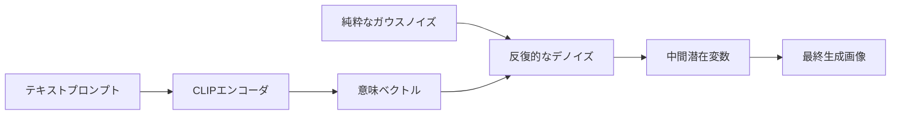
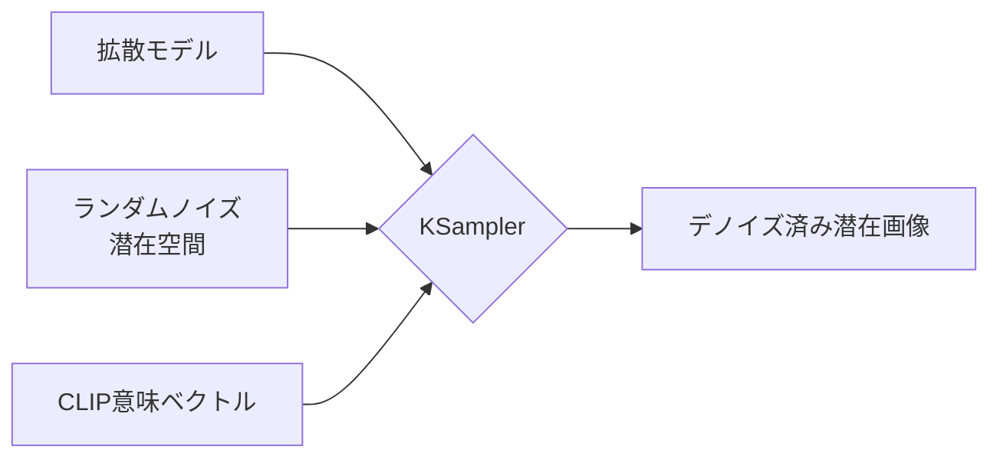

本ガイドでは、ComfyUIにおけるテキストから画像へ生成するワークフローの基本的な仕組みを紹介し、さまざまなComfyUIノードの機能と使い方について理解を深めます。

本ドキュメントでは、以下の内容を学びます：
- テキストから画像へ生成するワークフローの実行
- 拡散モデルの基本原理に関する概要的理解
- ワークフロー内の各ノードの機能と役割についての理解
- SD1.5モデルの基礎知識

まず、テキストから画像へ生成するワークフローを実際に実行し、その後関連する概念を順に解説していきます。必要に応じて、該当するセクションを選択して読み進めてください。

## テキストから画像へ（Text to Image）とは

**テキストから画像へ（Text to Image）** は、AIアート生成における基本的なプロセスであり、テキストによる説明文から対応する画像を生成します。その中心となるのは **拡散モデル（diffusion model）** です。

テキストから画像へ生成するプロセスには、以下の要素が必要です：
- **アーティスト（画家）：** 画像生成モデル
- **キャンバス（画布）：** 潜在空間（latent space）
- **画像の要件（プロンプト）：** 正のプロンプト（画像に含めたい要素）および負のプロンプト（画像に含めたくない要素）

このテキストから画像へ生成するプロセスは、単純化して言えば、あなたの要件（正のプロンプトおよび負のプロンプト）を **アーティスト（画像生成モデル）** に伝えることで、そのアーティストが要件に基づいて所望の画像を描き出すというプロセスと理解できます。

## ComfyUI テキストから画像へワークフローの実例ガイド

### 1. 準備

`ComfyUI/models/checkpoints` フォルダ内に、少なくとも1つのSD1.5モデルファイル（例：[v1-5-pruned-emaonly-fp16.safetensors](https://huggingface.co/Comfy-Org/stable-diffusion-v1-5-archive/blob/main/v1-5-pruned-emaonly-fp16.safetensors)）が存在することを確認してください。

まだインストールしていない場合は、[ComfyUIによるAIアート生成の始め方](/get_started/first_generation) の「モデルのインストール」セクションをご参照ください。

### 2. テキストから画像へワークフローの読み込み

下記の画像をダウンロードし、**ComfyUIの画面にドラッグ＆ドロップ**することで、ワークフローを読み込みます：


<Tip>
メタデータにワークフローJSONを含む画像は、ComfyUIの画面に直接ドラッグ＆ドロップするか、メニューの `Workflows` → `Open (ctrl+o)` を使って読み込むことができます。
</Tip>

### 3. モデルの読み込みと最初の画像生成

画像生成モデルのインストールが完了したら、下図の手順に従ってモデルを読み込み、最初の画像を生成してください。


図中の番号に従って、以下の手順を実行してください：
1. **Load Checkpoint** ノードで、矢印キーを使用するかテキスト領域をクリックして、**v1-5-pruned-emaonly-fp16.safetensors** が選択されていることを確認してください。左右の切り替え矢印に **null** と表示されていないことも確認してください。
2. `Queue` ボタンをクリックするか、ショートカット `Ctrl + Enter` を使用して画像生成を実行してください。

処理が完了すると、**Save Image** ノードのインターフェースに生成された画像が表示されます。右クリックすることで、ローカルに保存できます。


<Tip>生成結果に満足できない場合は、何度か再実行してみてください。各実行時、**KSampler** は `seed` パラメータに基づいて異なる乱数シードを使用するため、毎回異なる結果が得られます。</Tip>

### 4. 実験を始める

**CLIP Text Encoder** のテキストを編集してみましょう。


KSamplerノードに接続されている `Positive` は正のプロンプト（画像に含めたい要素）、`Negative` は負のプロンプト（画像に含めたくない要素）を表します。

SD1.5モデル向けの基本的なプロンプト作成の原則は以下の通りです：
- 可能な限り英語を使用する
- プロンプトは英語のカンマ `,` で区切る
- 長文ではなく、短いフレーズを使用する
- より具体的な記述を使用する
- `(golden hour:1.2)` のように、特定のキーワードの重みを高める表現を使い、画像への出現確率を上げることができます。ここで `1.2` は重み、`golden hour` はキーワードです
- `masterpiece, best quality, 4k` のようなキーワードを用いて、生成品質を向上させることができます

以下にいくつかのプロンプト例を示します。これらを使って生成を試すか、独自のプロンプトで実験してみてください：

**1. アニメスタイル**

正のプロンプト：
```
anime style, 1girl with long pink hair, cherry blossom background, studio ghibli aesthetic, soft lighting, intricate details

masterpiece, best quality, 4k
```

負のプロンプト：
```
low quality, blurry, deformed hands, extra fingers
```

**2. 写実的スタイル**

正のプロンプト：
```
(ultra realistic portrait:1.3), (elegant woman in crimson silk dress:1.2), 
full body, soft cinematic lighting, (golden hour:1.2), 
(fujifilm XT4:1.1), shallow depth of field, 
(skin texture details:1.3), (film grain:1.1), 
gentle wind flow, warm color grading, (perfect facial symmetry:1.3)
```

負のプロンプト：
```
(deformed, cartoon, anime, doll, plastic skin, overexposed, blurry, extra fingers)
```

**3. 特定のアーティストスタイル**

正のプロンプト：
```
fantasy elf, detailed character, glowing magic, vibrant colors, long flowing hair, elegant armor, ethereal beauty, mystical forest, magical aura, high detail, soft lighting, fantasy portrait, Artgerm style
```

負のプロンプト：
```
blurry, low detail, cartoonish, unrealistic anatomy, out of focus, cluttered, flat lighting
```

## テキストから画像へ生成の動作原理

テキストから画像へ生成する全体のプロセスは、**逆拡散プロセス（reverse diffusion process）** と理解できます。私たちがダウンロードした [v1-5-pruned-emaonly-fp16.safetensors](https://huggingface.co/Comfy-Org/stable-diffusion-v1-5-archive/blob/main/v1-5-pruned-emaonly-fp16.safetensors) は、事前に学習済みのモデルであり、**純粋なガウスノイズから目的の画像を生成**することができます。私たちは単にプロンプトを入力するだけで、ランダムノイズのデノイズを通じて目的の画像を生成できます。



以下の2つの概念を理解しておく必要があります：
1. **潜在空間（Latent Space）：** 潜在空間は、拡散モデルにおける抽象的なデータ表現方法です。画像をピクセル空間から潜在空間へ変換することで、ストレージ容量を削減し、拡散モデルの学習やデノイズの複雑さを軽減できます。これは、建築家が建物（ピクセル空間）に直接設計するのではなく、設計図（潜在空間）を使って設計するのと同様で、構造的特徴を維持しつつ、大幅に修正コストを低減できます。
2. **ピクセル空間（Pixel Space）：** ピクセル空間は、画像の保存領域であり、私たちが最終的に目にする画像で、ピクセル値を格納するために使用されます。

拡散モデルについてさらに詳しく知りたい場合は、以下の論文をご参照ください：
- [Denoising Diffusion Probabilistic Models (DDPM)](https://arxiv.org/pdf/2006.11239)
- [Denoising Diffusion Implicit Models (DDIM)](https://arxiv.org/pdf/2010.02502)
- [High-Resolution Image Synthesis with Latent Diffusion Models](https://arxiv.org/pdf/2112.10752)

## ComfyUI テキストから画像へワークフローのノード解説


### A. Load Checkpoint ノード


このノードは、通常画像生成モデルを読み込むために使用されます。`checkpoint` には通常、`MODEL (UNet)`、`CLIP`、`VAE` の3つのコンポーネントが含まれます。

- `MODEL (UNet)`：拡散プロセス中のノイズ予測および画像生成を担当するUNetモデル
- `CLIP`：テキストプロンプトをモデルが理解可能なベクトルに変換するテキストエンコーダ。モデルはテキストプロンプトを直接理解できないため、この変換が必要です
- `VAE`：画像をピクセル空間と潜在空間の間で相互変換する変分オートエンコーダ（Variational AutoEncoder）。拡散モデルは潜在空間で動作しますが、私たちの画像はピクセル空間にあるため、この変換が必要です

### B. Empty Latent Image ノード


KSamplerノードに出力される潜在空間を定義します。Empty Latent Imageノードは、**純粋なノイズを含む潜在空間**を構築します。

このノードの機能は、キャンバスのサイズ（つまり最終的に生成される画像の解像度）を定義することと理解できます。

### C. CLIP Text Encoder ノード


プロンプト（画像に対する要件）をエンコードするために使用されます。
- KSamplerノードに接続されている `Positive` 条件入力は、正のプロンプト（画像に含めたい要素）を表します
- KSamplerノードに接続されている `Negative` 条件入力は、負のプロンプト（画像に含めたくない要素）を表します

これらのプロンプトは、`Load Checkpoint` ノードから提供される `CLIP` コンポーネントによって意味ベクトルにエンコードされ、KSamplerノードへ条件として出力されます。

### D. KSampler ノード


**KSampler** は、ワークフロー全体の核となるノードであり、すべてのノイズデノイズ処理がここで行われ、最終的に潜在空間の画像が出力されます。



KSamplerノードのパラメータについての解説は以下の通りです：

| パラメータ名             | 説明                        | 機能                                                                                                    |
|--------------------------|-----------------------------|---------------------------------------------------------------------------------------------------------|
| **model**                | デノイズに使用する拡散モデル | 生成される画像のスタイルおよび品質を決定                                                                |
| **positive**             | 正のプロンプト条件エンコーディング | 指定された要素を含むように生成を誘導                                                                  |
| **negative**             | 負のプロンプト条件エンコーディング | 望ましくないコンテンツの生成を抑制                                                                    |
| **latent_image**         | デノイズ対象の潜在空間画像   | ノイズ初期化の入力キャリアとして機能                                                                  |
| **seed**                 | ノイズ生成の乱数シード       | 生成結果のランダム性を制御                                                                            |
| **control_after_generate** | 生成後のシード制御モード     | バッチ生成時のシードの変化パターンを決定                                                              |
| **steps**                | デノイズ反復ステップ数       | ステップ数が多いほど細部が精巧になるが、処理時間が長くなる                                              |
| **cfg**                  | クラシファイアフリー・ガイダンス係数 | プロンプト制約の強さを制御（高すぎると過学習を引き起こす）                                            |
| **sampler_name**         | サンプリングアルゴリズム名   | デノイズ経路の数学的計算手法を決定                                                                    |
| **scheduler**            | スケジューラタイプ           | ノイズの減衰率およびステップサイズの割り当てを制御                                                    |
| **denoise**              | デノイズ強度係数             | 潜在空間に加算されるノイズの強さを制御。0.0は元の入力特徴を保持、1.0は完全なノイズ状態を意味します |

KSamplerノードでは、潜在空間が `seed` を初期化パラメータとしてランダムノイズを構築し、意味ベクトル `Positive` および `Negative` が拡散モデルへの条件として入力されます。

その後、`steps` パラメータで指定されたデノイズステップ数に従ってデノイズが実行されます。各デノイズステップでは、`denoise` パラメータで指定されたデノイズ強度係数を用いて潜在空間のデノイズが行われ、新しい潜在空間画像が生成されます。

### E. VAE Decode ノード


**KSampler** から出力された潜在空間画像をピクセル空間画像へ変換します。

### F. Save Image ノード


潜在空間からデコードされた画像をプレビューし、ローカルの `ComfyUI/output` フォルダに保存します。

## SD1.5モデルの紹介

**SD1.5（Stable Diffusion 1.5）** は、[Stability AI](https://stability.ai/) が開発したAI画像生成モデルです。Stable Diffusionシリーズの基盤となるバージョンであり、**512×512** 解像度の画像で学習されています。そのため、この解像度での画像生成に特に優れています。サイズは約4GBで、**一般向けGPU（例：6GB VRAM）** 上でもスムーズに動作します。現在、SD1.5は豊かなエコシステムを有しており、ControlNetやLoRAなどの多様なプラグインおよび最適化ツールをサポートしています。
AIアート生成におけるマイルストーンモデルとして、SD1.5はオープンソースである点、軽量なアーキテクチャ、そして豊富なエコシステムといった特徴から、今なお最良の入門モデルです。SDXL／SD3などの新バージョンがリリースされていますが、一般向けハードウェアにおけるコストパフォーマンスは、依然として他を凌いでいます。

### 基本情報
- **リリース日：** 2022年10月
- **コアアーキテクチャ：** 潜在拡散モデル（Latent Diffusion Model：LDM）に基づく
- **学習データ：** LAION-Aesthetics v2.5データセット（約5億9千万ステップの学習）
- **オープンソース特性：** モデル、コード、学習データのすべてが完全にオープンソース

### 強みと限界
モデルの強み：
- 軽量性：サイズが小さく、約4GBで、一般向けGPU上でスムーズに動作
- 導入障壁が低い：幅広いプラグインおよび最適化ツールをサポート
- 成熟したエコシステム：豊富なプラグインおよびツールのサポート
- 生成速度が速い：一般向けGPU上でスムーズに動作

モデルの限界：
- 細部の処理：手や複雑なライティングにおいて歪みが生じやすい
- 解像度の制限：1024×1024の解像度を直接生成すると品質が低下
- プロンプト依存性：効果的な制御には正確な英語による記述が必要