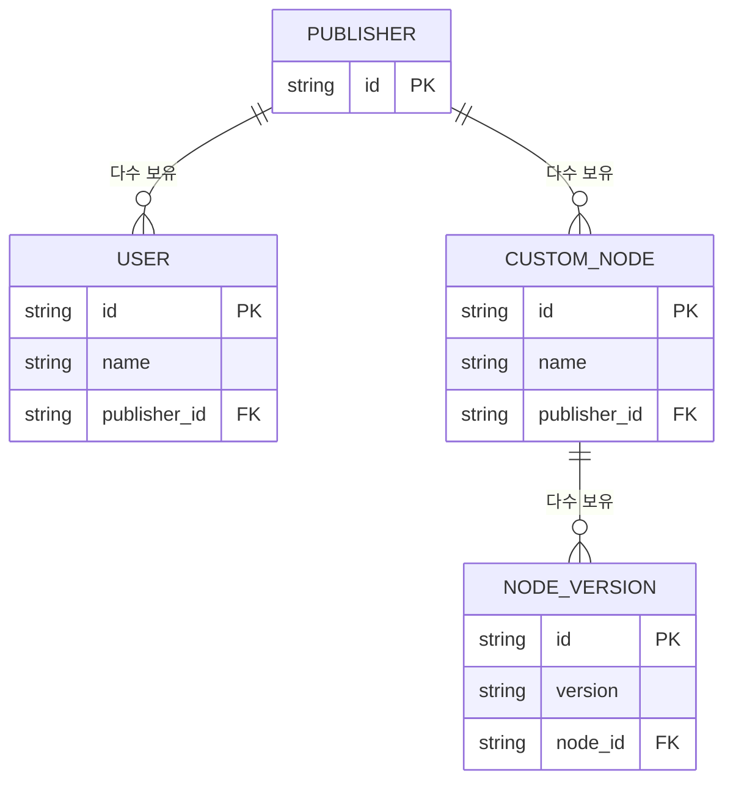

## 개요

커스텀 노드 레지스트리는 다음과 같은 구조를 따릅니다.

## 자주 사용하는 API

- **모든 노드 목록 조회** [API](/ko/registry/api-reference/nodes/retrieves-a-list-of-nodes)
- **노드 설치** [API](/ko/registry/api-reference/nodes/returns-a-node-version-to-be-installed)