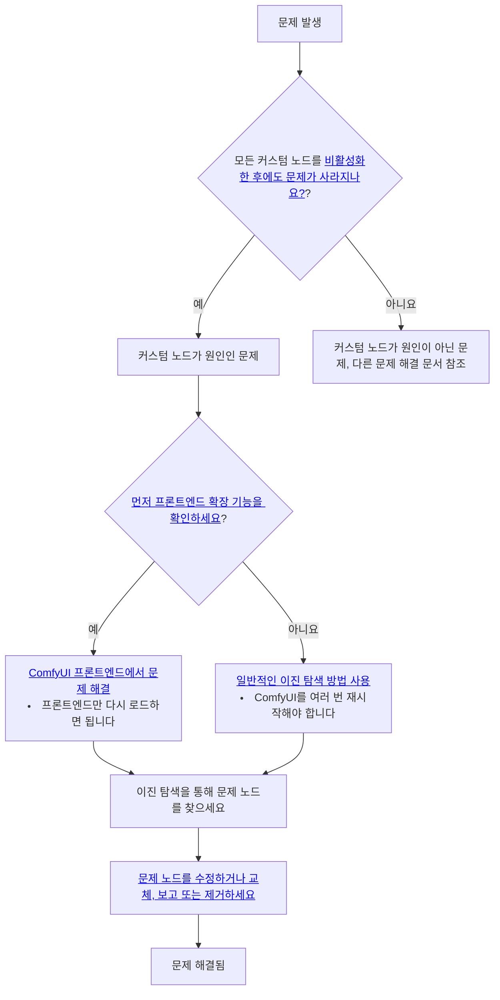
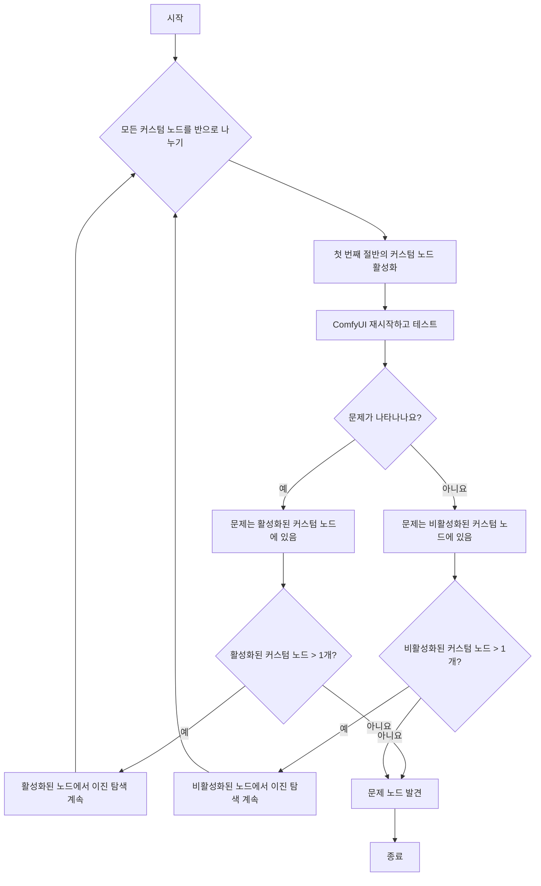

다음은 커스텀 노드 문제를 해결하기 위한 전반적인 접근법입니다:



## 모든 커스텀 노드를 비활성화하는 방법?

<Tabs>
<Tab title="데스크탑 사용자">
설정 메뉴에서 커스텀 노드를 비활성화한 상태로 ComfyUI 데스크탑을 시작하세요

또는 서버를 수동으로 실행하세요:
```bash
cd path/to/your/comfyui
python main.py --disable-all-custom-nodes
```
</Tab>
<Tab title="수동 설치">
```bash
cd ComfyUI
python main.py --disable-all-custom-nodes
```
</Tab>
<Tab title="휴대용">
<Tabs>
   <Tab title=".bat 파일 수정">
   휴대용 버전이 있는 폴더를 열고 `run_nvidia_gpu.bat` 또는 `run_cpu.bat` 파일을 찾으세요
   
   1. `run_nvidia_gpu.bat` 또는 `run_cpu.bat` 파일을 복사해 `run_nvidia_gpu_disable_custom_nodes.bat`로 이름을 변경하세요
   2. 복사한 파일을 메모장으로 열어주세요
   3. 파일에 `--disable-all-custom-nodes` 매개변수를 추가하거나, 아래의 매개변수를 `.txt` 파일에 복사해 `run_nvidia_gpu_disable_custom_nodes.bat`로 이름을 변경하세요
   ```bash
   .\python_embeded\python.exe -s ComfyUI\main.py --disable-all-custom-nodes  --windows-standalone-build
   pause
   ```
   4. 파일을 저장하고 닫으세요
   5. 파일을 더블클릭해 실행하세요. 정상적으로 작동한다면 ComfyUI가 시작되고 커스텀 노드가 비활성화된 것을 확인할 수 있습니다
   </Tab>
   <Tab title="명령줄을 통한 실행">
   
   1. 휴대용 버전이 있는 폴더로 들어가세요
   2. 마우스 오른쪽 클릭 → 터미널 열기를 통해 터미널을 엽니다
   
   3. 폴더 이름이 현재 휴대용 버전의 디렉토리인지 확인하세요
   4. 다음 명령어를 입력해 휴대용 파이썬을 통해 ComfyUI를 시작하고 커스텀 노드를 비활성화하세요
   ```
   .\python_embeded\python.exe -s ComfyUI\main.py --disable-all-custom-nodes
   ```
   </Tab>
</Tabs>
</Tab>
</Tabs>

**결과:**
- ✅ **문제 사라짐**: 커스텀 노드가 문제를 일으키고 있음 → 2단계로 진행
- ❌ **문제 지속**: 커스텀 노드 문제가 아님 → [문제 보고](#reporting-issues)

## 이진 탐색이란?

이 문서에서는 커스텀 노드 문제 해결을 위한 이진 탐색 방식을 소개합니다. 이 방식은 커스텀 노드를 두 개씩 나누어 절반씩 검사하며 문제 노드를 찾아가는 것입니다.

구체적인 방법은 아래 플로차트를 참고하세요 - 현재 비활성화된 노드 중 절반을 활성화하고 문제가 나타나는지 확인하며, 어느 커스텀 노드가 문제를 일으키는지 찾아갑니다.



## 두 가지 문제 해결 방법

이 문서에서는 커스텀 노드를 두 가지 유형으로 구분해 문제 해결을 안내합니다:


- A: 프론트엔드 확장 기능이 있는 커스텀 노드
- B: 일반 커스텀 노드

먼저 각 유형의 커스텀 노드가 가질 수 있는 문제와 원인을 알아보겠습니다:

<Tabs>
   <Tab title="프론트엔드 확장 기능이 있는 커스텀 노드">
   커스텀 노드 중에서도 프론트엔드 확장 기능이 있는 노드를 우선적으로 문제 해결해야 합니다. 이들은 가장 많은 문제를 일으키며, 주로 ComfyUI 프론트엔드 버전 업데이트와의 호환성 문제로 인해 발생합니다.

   일반적인 문제는 다음과 같습니다:
   - 워크플로 실행 불가
   - 일부 노드의 미리보기 이미지 표시 불가(예: 이미지 저장 노드)
   - UI 요소의 정렬 오류
   - ComfyUI 프론트엔드 접속 불가
   - UI 완전히 깨짐 또는 화면이 비어있음
   - ComfyUI 백엔드와 정상적으로 통신 불가
   - 노드 연결이 제대로 작동하지 않음
   - 그 외 다수

   이러한 문제의 일반적인 원인은 다음과 같습니다:
   - 업데이트 과정에서 프론트엔드가 변경되었으나 커스텀 노드가 아직 이를 따라가지 못한 경우
   - 작성자가 호환 가능한 버전을 출시했음에도 사용자가 ComfyUI를 업데이트하면서 커스텀 노드도 동기화하지 않은 경우
   - 작성자가 유지보수를 중단해 커스텀 노드 확장 기능과 ComfyUI 프론트엔드 간의 호환성이 깨진 경우

   </Tab>
   <Tab title="일반 커스텀 노드">
   문제가 커스텀 노드의 프론트엔드 확장 기능 때문이 아니라면 종종 의존성 관련 문제가 발생합니다. 일반적인 문제는 다음과 같습니다:
   - 콘솔/로그에 "불러오기 실패" 오류
   - 설치 및 재시작 후에도 여전히 노드가 누락된 것으로 표시됨
   - ComfyUI가 충돌하거나 시작되지 않음
   - 그 외 다수

   이러한 오류의 일반적인 원인은 다음과 같습니다:
   - ComfyUI-Nunchaku와 같은 추가 wheel이 필요한 커스텀 노드
   - 특정 의존성 버전(예: `torch==2.4.1`)을 사용하는 커스텀 노드와 다른 플러그인들이 다른 버전(예: `torch>=2.4.2`)을 사용해 설치 후 충돌이 발생한 경우
   - 네트워크 문제로 인해 의존성 설치가 성공하지 못한 경우

   문제가 파이썬 환경의 상호 의존성과 버전과 관련되어 있을 때는 문제 해결이 더욱 복잡해지고, 의존성 설치 및 제거 방법 등 파이썬 환경 관리에 대한 지식이 필요합니다.
   </Tab>
</Tabs>

## 이진 탐색을 이용한 문제 해결

위 두 가지 유형의 커스텀 노드 문제 중에서도 커스텀 노드 프론트엔드 확장 기능과 ComfyUI 간의 충돌이 더 흔하게 발생합니다. 우리는 먼저 이 노드들을 우선적으로 문제 해결하겠습니다. 전체적인 문제 해결 방식은 다음과 같습니다:

### 1. 커스텀 노드의 프론트엔드 확장 기능 문제 해결

<Steps>
   <Step title="모든 서드파티 프론트엔드 확장 기능 비활성화">
   
   ComfyUI를 시작한 후 설정에서 `Extensions` 메뉴를 찾아 이미지에 표시된 단계를 따라 모든 서드파티 확장 기능을 비활성화하세요
   <Tip>
      ComfyUI 프론트엔드에 진입할 수 없다면 프론트엔드 확장 기능 문제 해결 부분을 건너뛰고 [일반 커스텀 노드 문제 해결 방식](#2-general-custom-node-troubleshooting-approach)으로 넘어가세요
   </Tip>
   </Step>
   <Step title="ComfyUI 재시작">
   첫 번째로 프론트엔드 확장 기능을 비활성화한 후, 모든 프론트엔드 확장 기능이 제대로 비활성화되었는지 확인하려면 ComfyUI를 재시작하는 것이 좋습니다
   - 문제가 사라졌다면 커스텀 노드 프론트엔드 확장 기능이 원인이므로 이진 탐색을 통해 문제를 해결할 수 있습니다
   - 문제가 지속된다면 프론트엔드 확장 기능이 원인이 아닙니다 - 이 문서의 다른 문제 해결 방식을 참고하세요
   </Step>
   <Step title="이진 탐색을 이용해 문제 노드 찾기">
   이 문서 앞부분에서 언급한 방법을 사용해 문제 노드를 찾으세요. 한 번에 커스텀 노드의 절반을 활성화하며 문제가 되는 노드를 찾아갑니다
   
   이미지를 참고해 프론트엔드 확장 기능의 절반을 활성화하세요. 확장 기능 이름이 비슷하다면 대부분 같은 커스텀 노드의 프론트엔드 확장 기능임을 의미합니다
   </Step>
   <Step title="후속 조치">
   문제가 되는 커스텀 노드를 찾았다면 이 문서의 문제 해결 섹션을 참고해 커스텀 노드 문제를 해결하세요
   </Step>
</Steps>

이 방법을 사용하면 ComfyUI를 여러 번 재시작할 필요가 없습니다 - 커스텀 노드 프론트엔드 확장 기능을 활성화하거나 비활성화한 후 ComfyUI를 다시 로드하기만 하면 됩니다. 또한 문제 해결 범위가 프론트엔드 확장 기능이 있는 노드로 한정되므로 검색 범위가 크게 줄어듭니다.

### 2. 일반 커스텀 노드 문제 해결


<Steps>
  <Step title="이진 탐색을 이용해 커스텀 노드 찾기">
      이진 탐색을 이용한 위치 파악 방법에는 수동 검색 외에도 아래와 같이 comfy-cli를 이용한 자동 이진 탐색도 가능합니다:

      <Tabs>
         <Tab title="Comfy CLI 사용 (권장)">
         Comfy CLI를 사용하려면 약간의 명령줄 경험이 필요합니다. 익숙하지 않다면 수동 이진 탐색을 사용하세요.

         [Comfy CLI](/ko/comfy-cli/getting-started)가 설치되어 있다면 자동 bisect 도구를 사용해 문제 노드를 찾을 수 있습니다:

         ```bash
         # bisect 세션 시작
         comfy-cli node bisect start

         # 안내에 따라:
         # - 현재 활성화된 노드 세트로 ComfyUI 테스트
         # - 문제가 사라졌다면 'good'로 표시: comfy-cli node bisect good
         # - 문제가 지속된다면 'bad'로 표시: comfy-cli node bisect bad
         # - 문제가 발견될 때까지 반복

         # 완료 시 초기화
         comfy-cli node bisect reset
         ```

         bisect 도구는 자동으로 노드를 활성화/비활성화하며 과정을 안내해줍니다.

         </Tab>
         <Tab title="수동 이진 탐색">
            <Warning>
            시작하기 전에, 혹시라도 문제가 생길 경우를 대비해 맞춤노드 폴더의 백업을 꼭 만들어두세요.
            </Warning>

         수동으로 진행하거나 Comfy CLI가 설치되지 않았다면 아래 단계를 따르세요:

         <Steps>
            <Step title="임시 폴더 생성">
            시작하기 전에 `<YOUR_COMFYUI_FOLDER>\ComfyUI\` 폴더로 들어가세요
                  <Tabs>
                     <Tab title="Windows">
                     - **모든 커스텀 노드 백업**: `custom_nodes`를 복사해 `custom_nodes_backup`으로 이름 변경
                     - **임시 폴더 생성**: `custom_nodes_temp`라는 폴더를 생성하세요

                     또는 다음 명령어를 사용해 백업하세요:

                     ```bash
                     # 백업 및 임시 폴더 생성
                     mkdir "%USERPROFILE%\custom_nodes_backup"
                     mkdir "%USERPROFILE%\custom_nodes_temp"

                     # 모든 내용 백업
                     xcopy "custom_nodes\*" "%USERPROFILE%\custom_nodes_backup\" /E /H /Y
                     ```
                     </Tab>
                     <Tab title="macOS/Linux">
                     수동으로 custom_nodes 폴더 백업
                     또는 다음 명령어를 사용해 백업하세요:
                     ```bash
                     # 백업 및 임시 폴더 생성
                     mkdir ~/custom_nodes_backup
                     mkdir ~/custom_nodes_temp

                     # 모든 내용 백업
                     cp -r custom_nodes/* ~/custom_nodes_backup/
                     ```
                     </Tab>
                     <Tab title="클라우드/Colab">
                     ```bash
                     # 백업 및 임시 폴더 생성
                     mkdir /content/custom_nodes_backup
                     mkdir /content/custom_nodes_temp

                     # 모든 내용 백업
                     cp -r /content/ComfyUI/custom_nodes/* /content/custom_nodes_backup/
                     ```
                     </Tab>
                  </Tabs>
               </Step>
               <Step title="모든 커스텀 노드 목록 만들기">
                   <Tabs>
                     <Tab title="Windows">
                     Windows는 시각적 인터페이스를 제공하므로 명령줄만 사용하는 경우가 아니라면 이 단계를 생략해도 됩니다
                     ```bash
                     dir custom_nodes
                     ```
                     </Tab>
                     <Tab title="macOS/Linux">
                     ```bash
                     ls custom_nodes/
                     ```
                     </Tab>
                     <Tab title="클라우드/Colab">
                     ```bash
                     ls /content/ComfyUI/custom_nodes/
                     ```
                     </Tab>
                  </Tabs>
               </Step>
               <Step title="노드를 절반으로 나누기">
               8개의 커스텀 노드가 있다고 가정해봅시다. 첫 번째 절반을 임시 저장소로 옮기세요:
                  <Tabs>
                  <Tab title="Windows">
                  ```bash
                  # 첫 번째 절반(노드 1~4)을 임시로 이동
                  move "custom_nodes\node1" "%USERPROFILE%\custom_nodes_temp\"
                  move "custom_nodes\node2" "%USERPROFILE%\custom_nodes_temp\"
                  move "custom_nodes\node3" "%USERPROFILE%\custom_nodes_temp\"
                  move "custom_nodes\node4" "%USERPROFILE%\custom_nodes_temp\"
                  ```
                  </Tab>
                  <Tab title="macOS/Linux">
                  ```bash
                  # 첫 번째 절반(노드 1~4)을 임시로 이동
                  mv custom_nodes/node1 ~/custom_nodes_temp/
                  mv custom_nodes/node2 ~/custom_nodes_temp/
                  mv custom_nodes/node3 ~/custom_nodes_temp/
                  mv custom_nodes/node4 ~/custom_nodes_temp/
                  ```
                  </Tab>
                  <Tab title="클라우드/Colab">
                  ```bash
                  # 첫 번째 절반(노드 1~4)을 임시로 이동
                  mv /content/ComfyUI/custom_nodes/node1 /content/custom_nodes_temp/
                  mv /content/ComfyUI/custom_nodes/node2 /content/custom_nodes_temp/
                  mv /content/ComfyUI/custom_nodes/node3 /content/custom_nodes_temp/
                  mv /content/ComfyUI/custom_nodes/node4 /content/custom_nodes_temp/
                  ```
                  </Tab>
                  </Tabs>
               </Step>
               <Step title="ComfyUI 테스트">
               정상적으로 ComfyUI를 시작하세요
                  ```bash
                  python main.py
                  ```
               </Step>
               <Step title="결과 해석">
                  - **문제 지속**: 남은 노드(5~8)에 문제가 있음
                  - **문제 사라짐**: 이동한 노드(1~4)에 문제가 있었음
               </Step>
               <Step title="범위 좁히기">
                  - 문제가 지속된다면 남은 노드의 절반(예: 노드 7~8)을 임시로 이동
                  - 문제가 사라졌다면 임시 노드의 절반(예: 노드 3~4)을 custom_nodes로 다시 이동
               </Step>
               <Step title="문제 노드를 찾을 때까지 반복">
                  - 문제 노드를 찾을 때까지 반복
               </Step>
            </Steps>
         </Tab>
      </Tabs>
   </Step>
</Steps>

## 문제 해결 방법

문제 노드를 찾았다면:

### 옵션 1: 노드 업데이트
1. ComfyUI Manager에서 업데이트가 있는지 확인하세요
2. 노드를 업데이트하고 다시 테스트하세요

### 옵션 2: 노드 교체
1. 비슷한 기능을 가진 대체 커스텀 노드를 찾아보세요
2. [ComfyUI 레지스트리](https://registry.comfy.org)에서 대체품을 확인하세요

### 옵션 3: 문제 보고
커스텀 노드 개발자에게 연락하세요:
1. 노드의 GitHub 리포지토리를 찾아보세요
2. 다음 정보를 포함해 이슈를 생성하세요:
   - ComfyUI 버전
   - 오류 메시지/로그
   - 재현 단계
   - 운영체제

### 옵션 4: 노드 제거 또는 비활성화
해결 방법이 없고 기능이 필요하지 않다면:
1. 문제가 되는 노드를 `custom_nodes/`에서 삭제하거나 ComfyUI Manager 인터페이스에서 비활성화하세요
2. ComfyUI를 재시작하세요

## 문제 보고

커스텀 노드가 원인이 아닌 문제라면 일반적인 [문제 해결 개요](/ko/troubleshooting/overview)를 참고해 다른 공통 문제를 해결하세요.

### 커스텀 노드 특별 문제
커스텀 노드 개발자에게 연락하세요:
- 노드의 GitHub 리포지토리를 찾아보세요
- ComfyUI 버전, 오류 메시지, 재현 단계, 운영체제를 포함해 이슈를 생성하세요
- 노드의 문서와 이슈 페이지에서 이미 알려진 문제를 확인하세요

### ComfyUI 핵심 문제
- **GitHub**: [ComfyUI 이슈](https://github.com/Comfy-Org/ComfyUI/issues)
- **포럼**: [공식 ComfyUI 포럼](https://forum.comfy.org/)

### 데스크탑 앱 문제
- **GitHub**: [ComfyUI 데스크탑 이슈](https://github.com/Comfy-Org/desktop/issues)

### 프론트엔드 문제
- **GitHub**: [ComfyUI 프론트엔드 이슈](https://github.com/Comfy-Org/ComfyUI_frontend/issues)

<Note>
일반적인 설치, 모델 또는 성능 문제는 [문제 해결 개요](/ko/troubleshooting/overview)와 [모델 문제](/ko/troubleshooting/model-issues) 페이지를 참고하세요.
</Note>