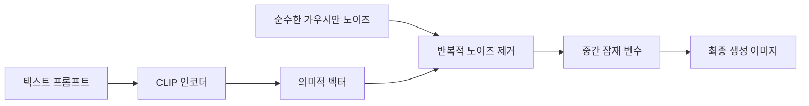
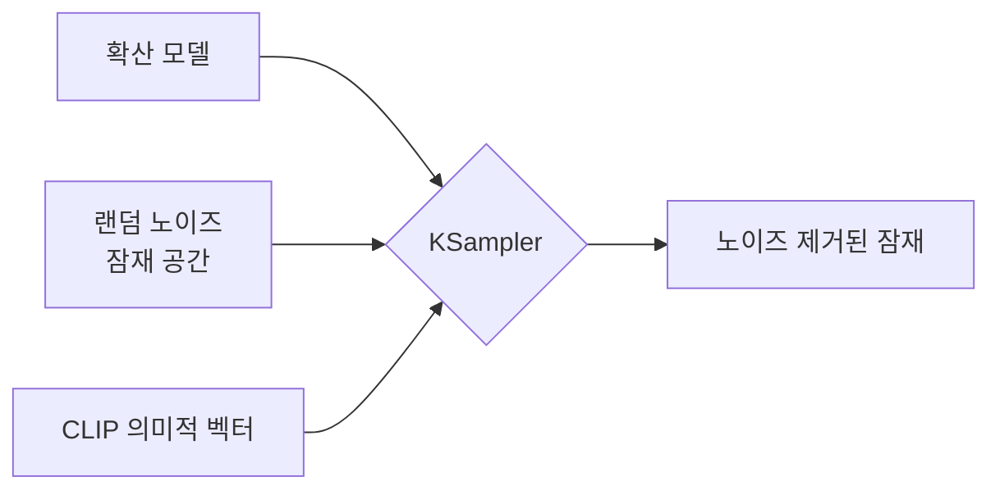

이 가이드는 ComfyUI의 텍스트-to-이미지 워크플로우를 소개하고 다양한 ComfyUI 노드의 기능과 사용법을 이해하도록 돕습니다.

이 문서에서는 다음을 다룹니다:
- 텍스트-to-이미지 워크플로우 완료하기
- 확산 모델 원리에 대한 기본적인 이해하기
- 워크플로우 노드의 기능과 역할 알아보기
- SD1.5 모델에 대한 초기 이해하기

먼저 텍스트-to-이미지 워크플로우를 실행한 후 관련 개념에 대한 설명을 이어갑니다. 필요에 따라 관련 섹션을 선택해 주세요.

## 텍스트-to-이미지란?

**텍스트-to-이미지**는 텍스트 설명을 통해 이미지를 생성하는 AI 아트 생성의 핵심 과정으로, 그 중심에는 **확산 모델**이 있습니다.

텍스트-to-이미지 과정에는 다음과 같은 요소가 필요합니다:
- **아티스트**: 이미지 생성 모델
- **캔버스**: 잠재 공간
- **이미지 요구사항(프롬프트)**: 긍정적 프롬프트(이미지에 포함되기를 원하는 요소)와 부정적 프롬프트(포함되지 않기를 원하는 요소) 포함

이 텍스트-to-이미지 생성 과정은 간단히 말해, 당신의 요구사항(긍정적·부정적 프롬프트)을 **아티스트(이미지 모델)**에게 전달하면, 아티스트가 이러한 요구사항에 맞춰 원하는 이미지를 만들어내는 것입니다.

## ComfyUI 텍스트-to-이미지 워크플로우 예제 가이드

### 1. 준비 작업

`ComfyUI/models/checkpoints` 폴더에 최소 한 개의 SD1.5 모델 파일이 있는지 확인하세요. 예를 들어 [v1-5-pruned-emaonly-fp16.safetensors](https://huggingface.co/Comfy-Org/stable-diffusion-v1-5-archive/blob/main/v1-5-pruned-emaonly-fp16.safetensors)가 있습니다.

아직 설치하지 않았다면, [ComfyUI AI 아트 생성 시작하기](/ko/get_started/first_generation)의 모델 설치 섹션을 참고해 주세요.

### 2. 텍스트-to-이미지 워크플로우 로드하기

아래 이미지를 다운로드한 후, **ComfyUI로 드래그하여 워크플로우를 로드**하세요:


<Tip>
워크플로우 JSON이 메타데이터에 포함된 이미지는 바로 ComfyUI로 드래그하거나, 메뉴 `Workflows` -> `Open (ctrl+o)`를 이용해 로드할 수 있습니다.
</Tip>

### 3. 모델 로드 및 첫 번째 이미지 생성하기

이미지 모델을 설치한 후, 아래 이미지를 따라 모델을 로드하고 첫 번째 이미지를 생성하세요.


이미지 번호에 따라 다음 단계를 따르세요:
1. **Load Checkpoint** 노드에서 화살표를 사용하거나 텍스트 영역을 클릭해 **v1-5-pruned-emaonly-fp16.safetensors**가 선택되었는지 확인하고, 좌우 화살표에 **null** 텍스트가 표시되지 않도록 하세요.
2. `Queue` 버튼을 클릭하거나 단축키 `Ctrl + Enter`를 사용해 이미지 생성을 실행하세요.

과정이 완료되면, **Save Image** 노드 인터페이스에 결과 이미지가 나타나며, 마우스 오른쪽 버튼을 클릭해 로컬에 저장할 수 있습니다.


<Tip>결과가 만족스럽지 않다면 여러 번 생성해 보세요. 각각의 생성 과정에서 **KSampler**는 `seed` 파라미터에 따라 다른 난수 시드를 사용하므로, 매번 다른 결과가 나옵니다.</Tip>

### 4. 실험 시작하기

**CLIP Text Encoder**의 텍스트를 수정해 보세요.


KSampler 노드에 연결된 `Positive` 연결은 긍정적 프롬프트를, `Negative` 연결은 부정적 프롬프트를 나타냅니다.

SD1.5 모델을 위한 몇 가지 기본 프롬프팅 원칙은 다음과 같습니다:
- 가능하면 영어를 사용하세요.
- 프롬프트는 영어 쉼표 `,`로 구분하세요.
- 긴 문장보다는 구체적인 표현을 사용하세요.
- 구체적인 묘사를 사용하세요.
- `(golden hour:1.2)`와 같은 표현을 사용해 특정 키워드의 중요도를 높여 이미지에 더 많이 나타나게 할 수 있습니다. 여기서 `1.2`는 가중치이고, `golden hour`는 키워드입니다.
- `masterpiece, best quality, 4k`와 같은 키워드를 사용해 생성 품질을 높일 수 있습니다.

다음은 몇 가지 프롬프트 예시를 시도해 볼 수 있으며, 직접 만든 프롬프트로도 생성해 보세요:

**1. 애니메이션 스타일**

긍정적 프롬프트:
```
anime style, 1girl with long pink hair, cherry blossom background, studio ghibli aesthetic, soft lighting, intricate details

masterpiece, best quality, 4k
```

부정적 프롬프트:
```
low quality, blurry, deformed hands, extra fingers
```

**2. 사실적 스타일**

긍정적 프롬프트:
```
(ultra realistic portrait:1.3), (elegant woman in crimson silk dress:1.2), 
full body, soft cinematic lighting, (golden hour:1.2), 
(fujifilm XT4:1.1), shallow depth of field, 
(skin texture details:1.3), (film grain:1.1), 
gentle wind flow, warm color grading, (perfect facial symmetry:1.3)
```

부정적 프롬프트:
```
(deformed, cartoon, anime, doll, plastic skin, overexposed, blurry, extra fingers)
```

**3. 특정 아티스트 스타일**

긍정적 프롬프트:
```
fantasy elf, detailed character, glowing magic, vibrant colors, long flowing hair, elegant armor, ethereal beauty, mystical forest, magical aura, high detail, soft lighting, fantasy portrait, Artgerm style
```

부정적 프롬프트:
```
blurry, low detail, cartoonish, unrealistic anatomy, out of focus, cluttered, flat lighting
```

## 텍스트-to-이미지 작동 원리

텍스트-to-이미지 전체 과정은 **역확산 과정**으로 이해할 수 있습니다. 우리가 다운로드한 [v1-5-pruned-emaonly-fp16.safetensors](https://huggingface.co/Comfy-Org/stable-diffusion-v1-5-archive/blob/main/v1-5-pruned-emaonly-fp16.safetensors)는 사전 훈련된 모델로, **순수한 가우시안 노이즈로부터 목표 이미지를 생성**할 수 있습니다. 우리는 단지 우리의 프롬프트만 입력하면, 무작위 노이즈를 제거해 목표 이미지를 생성할 수 있습니다.



우리는 두 가지 개념을 이해해야 합니다:
1. **잠재 공간**: 잠재 공간은 확산 모델에서 사용하는 추상적인 데이터 표현 방식입니다. 이미지를 픽셀 공간에서 잠재 공간으로 변환하면 저장 공간이 줄어들고, 확산 모델 훈련과 노이즈 제거 복잡성을 줄이는 데 유리합니다. 마치 건축가들이 건물 설계 대신 설계도(잠재 공간)를 사용하는 것과 같으며, 구조적 특징을 유지하면서 수정 비용을 크게 줄일 수 있습니다.
2. **픽셀 공간**: 픽셀 공간은 이미지를 저장하는 공간으로, 우리가 최종적으로 보는 이미지이며 픽셀 값을 저장합니다.

확산 모델에 대해 더 자세히 알고 싶다면 다음 논문들을 읽어보세요:
- [노이즈 제거 확산 확률 모델(DDPM)](https://arxiv.org/pdf/2006.11239)
- [노이즈 제거 확산 암묵적 모델(DDIM)](https://arxiv.org/pdf/2010.02502)
- [잠재 확산 모델을 통한 고해상도 이미지 합성](https://arxiv.org/pdf/2112.10752)

## ComfyUI 텍스트-to-이미지 워크플로우 노드 설명


### A. Load Checkpoint 노드


이 노드는 일반적으로 이미지 생성 모델을 로드하는 데 사용됩니다. `checkpoint`는 보통 세 가지 구성 요소를 포함합니다: `MODEL (UNet)`, `CLIP`, 그리고 `VAE`

- `MODEL (UNet)`: 확산 과정 중 노이즈 예측과 이미지 생성을 담당하는 UNet 모델
- `CLIP`: 텍스트 프롬프트를 모델이 이해할 수 있는 벡터로 변환하는 텍스트 인코더로, 모델은 직접 텍스트 프롬프트를 이해할 수 없기 때문입니다.
- `VAE`: 이미지를 픽셀 공간과 잠재 공간 간에 변환하는 변분 AutoEncoder로, 확산 모델은 잠재 공간에서 작동하며 우리의 이미지는 픽셀 공간에 있습니다.

### B. Empty Latent Image 노드


KSampler 노드로 출력되는 잠재 공간을 정의합니다. Empty Latent Image 노드는 **순수한 노이즈 잠재 공간**을 구성합니다.

이 노드의 기능을 캔버스 크기 정의라고 생각할 수 있으며, 이는 최종 생성 이미지의 크기를 결정합니다.

### C. CLIP Text Encoder 노드


프롬프트를 인코딩하는 데 사용되며, 이는 이미지에 대한 귀하의 요구사항입니다.
- KSampler 노드에 연결된 `Positive` 조건 입력은 긍정적 프롬프트(이미지에 포함되기를 원하는 요소)를 나타냅니다.
- KSampler 노드에 연결된 `Negative` 조건 입력은 부정적 프롬프트(이미지에 포함되지 않기를 원하는 요소)를 나타냅니다.

프롬프트는 `Load Checkpoint` 노드의 `CLIP` 구성 요소에 의해 의미적 벡터로 인코딩되고, KSampler 노드에 조건으로 출력됩니다.

### D. KSampler 노드


**KSampler**는 전체 워크플로우의 핵심으로, 모든 노이즈 제거 과정이 이루어지며 결국 잠재 공간 이미지를 출력합니다.



KSampler 노드의 파라미터 설명은 다음과 같습니다:

| 파라미터 이름             | 설명                        | 기능                                                                                                    |
|----------------------------|------------------------------------|-------------------------------------------------------------------------------------------------------------|
| **model**                  | 노이즈 제거에 사용되는 확산 모델 | 생성 이미지의 스타일과 품질을 결정합니다                                                        |
| **positive**               | 긍정적 프롬프트 조건 인코딩 | 지정된 요소를 포함하도록 생성을 유도합니다                                                     |
| **negative**               | 부정적 프롬프트 조건 인코딩 | 원치 않는 내용을 억제합니다                                                                   |
| **latent_image**           | 노이즈 제거할 잠재 공간 이미지  | 노이즈 초기화를 위한 입력 캐리어 역할을 합니다                                                |
| **seed**                   | 노이즈 생성용 난수 시드   | 생성의 무작위성을 제어합니다                                                                  |
| **control_after_generate** | 생성 후 시드 제어 모드    | 배치 생성 시 시드 변동 패턴을 결정합니다                                                      |
| **steps**                  | 노이즈 제거 반복 횟수     | 더 많은 단계는 더 세밀한 디테일을 제공하지만 처리 시간이 길어집니다                          |
| **cfg**                    | 분류자 없는 안내 스케일     | 프롬프트 제약 강도를 제어합니다 (너무 높으면 과적합을 초래합니다)                              |
| **sampler_name**           | 샘플링 알고리즘 이름            | 노이즈 제거 경로의 수학적 방법을 결정합니다                                                  |
| **scheduler**              | 스케줄러 유형                     | 노이즈 감쇠율과 단계 크기 할당을 제어합니다                                                   |
| **denoise**                | 노이즈 제거 강도 계수     | 잠재 공간에 추가되는 노이즈 강도를 제어하며, 0.0은 원본 입력 특징을 유지하고, 1.0은 완전한 노이즈입니다 |

KSampler 노드에서 잠재 공간은 `seed`를 초기화 파라미터로 사용해 랜덤 노이즈를 구성하고, 의미적 벡터 `Positive`와 `Negative`는 조건으로 확산 모델에 입력됩니다.

그런 다음, `steps` 파라미터로 지정된 노이즈 제거 단계 수에 따라 노이즈 제거가 수행됩니다. 각 노이즈 제거 단계는 `denoise` 파라미터로 지정된 노이즈 제거 강도 계수를 사용해 잠재 공간을 노이즈 제거하고 새로운 잠재 공간 이미지를 생성합니다.

### E. VAE 디코드 노드


**KSampler**에서 출력된 잠재 공간 이미지를 픽셀 공간 이미지로 변환합니다.

### F. Save Image 노드


디코드된 이미지를 미리보기하고, 잠재 공간에서 로컬 `ComfyUI/output` 폴더로 저장합니다.

## SD1.5 모델 소개

**SD1.5 (Stable Diffusion 1.5)**는 [Stability AI](https://stability.ai/)에서 개발한 AI 이미지 생성 모델입니다. Stable Diffusion 시리즈의 기본 버전으로, **512×512** 해상도 이미지로 훈련되어 이 해상도에서 특히 뛰어난 이미지 생성 성능을 발휘합니다. 약 4GB 크기로, **소비자급 GPU(예: 6GB VRAM)**에서도 원활하게 작동합니다. 현재 SD1.5는 다양한 플러그인(예: ControlNet, LoRA)과 최적화 도구를 지원하는 풍부한 생태계를 갖추고 있습니다.

AI 아트 생성의 이정표와 같은 모델로서, SD1.5는 오픈소스 성격과 경량 아키텍처, 풍부한 생태계 덕분에 여전히 최고의 입문용 선택입니다. SDXL/SD3와 같은 신버전이 출시되었지만, 소비자급 하드웨어에서의 가치는 여전히 타의 추종을 불허합니다.

### 기본 정보
- **출시일**: 2022년 10월
- **핵심 아키텍처**: 잠재 확산 모델(LDM) 기반
- **훈련 데이터**: LAION-Aesthetics v2.5 데이터셋(약 5.9억 회 훈련 단계)
- **오픈소스 특징**: 모델/코드/훈련 데이터 모두 완전 오픈소스

### 장점과 한계
모델 장점:
- 경량: 약 4GB 크기로 소비자 GPU에서도 원활히 작동
- 진입 장벽 낮음: 다양한 플러그인과 최적화 도구를 지원
- 성숙한 생태계: 광범위한 플러그인 및 도구 지원
- 빠른 생성: 소비자 GPU에서도 원활한 작동

모델 한계:
- 디테일 처리: 손이나 복잡한 조명에서 왜곡 발생 가능성
- 해상도 제한: 직접 1024x1024 생성 시 품질 저하
- 프롬프트 의존성: 정확한 영어 설명이 제어에 필수적임