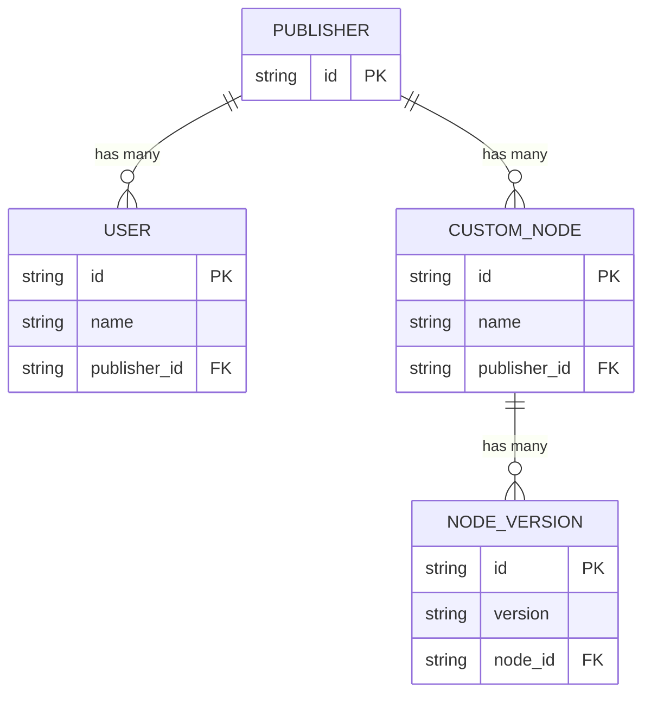

## Overview

The Custom Node Registry follows this structure:

## Commonly Used APIs

- **List All Nodes** [API](/registry/api-reference/nodes/retrieves-a-list-of-nodes)
- **Install a Node** [API](/registry/api-reference/nodes/returns-a-node-version-to-be-installed)
