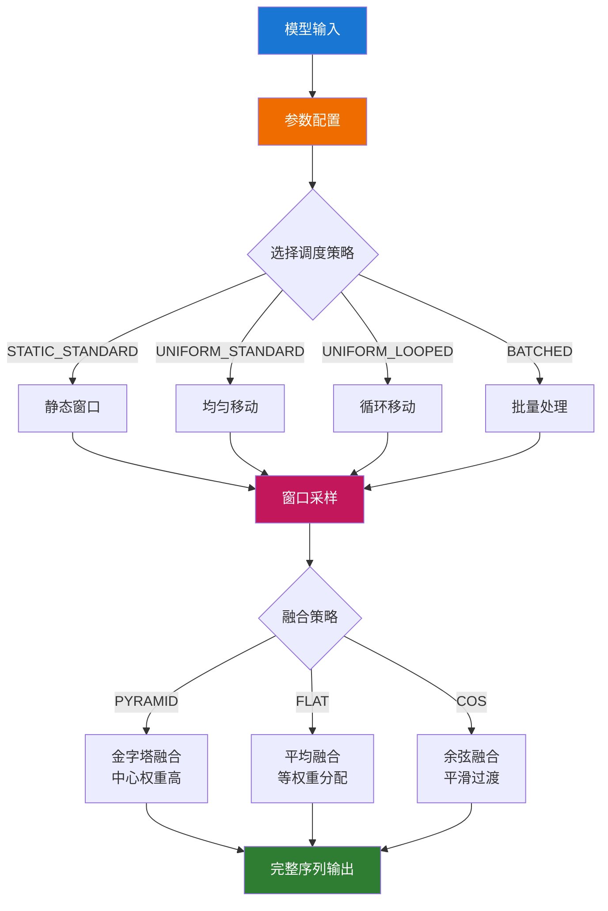
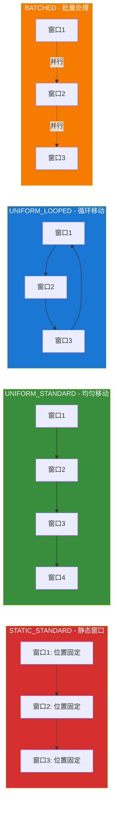
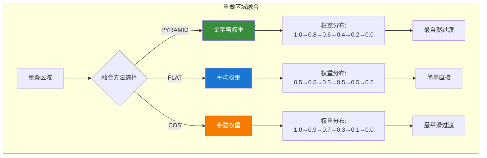

`Context Windows (Manual)` 节点提供完全手动的上下文窗口控制功能。它将长序列分解为多个重叠的上下文窗口进行采样，而不是一次性处理整个序列，从而有效管理显存使用并实现高质量的长序列生成。

## 输入参数

| 参数名称 | 功能说明 | 详细解释 |
|---------|----------|----------|
| `model` | 模型输入 | 需要应用上下文窗口处理的基础模型对象 |
| `context_length` | 窗口长度控制 | 每个上下文窗口的长度，值越大处理范围越广但显存占用更高 |
| `context_overlap` | 窗口重叠设置 | 相邻窗口间的重叠区域大小，确保窗口间内容连贯性，重叠越多越平滑但处理时间更长 |
| `context_schedule` | 调度策略选择 | 控制窗口如何在序列上移动和排布，包括静态、均匀、循环、批处理四种模式 |
| `context_stride` | 移动步长 | 窗口每次移动的步长大小，仅在 UNIFORM 调度模式下生效，控制窗口移动的精细程度 |
| `closed_loop` | 循环模式开关 | 是否将最后一个窗口与第一个窗口连接形成循环，仅在 LOOPED 调度模式下生效 |
| `fuse_method` | 融合方法 | 决定重叠区域如何合并的算法，影响窗口间过渡的平滑程度和最终效果 |
| `dim` | 应用维度 | 指定在哪个数据维度上应用上下文窗口处理，通常为0（时间维度） |

## 上下文调度策略

| 调度策略 | 工作方式 | 最佳使用场景 |
|---------|----------|-------------|
| **STATIC_STANDARD** | 窗口位置固定不动 | 处理固定区域内容，需要精确控制位置的任务 |
| **UNIFORM_STANDARD** | 窗口按设定步长均匀移动 | 长序列的连续处理，如长文本或长视频序列 |
| **UNIFORM_LOOPED** | 均匀移动并首尾相连 | 循环内容处理，如背景音乐、重复图案生成 |
| **BATCHED** | 多个窗口并行批处理 | 大量数据的高效处理，适合显存充足的情况 |

## 融合方法

| 融合方法 | 权重分布方式 | 效果特点 |
|---------|-------------|----------|
| **PYRAMID** | 中心区域权重最高，向边缘递减 | 最自然的过渡效果，推荐大多数场景使用 |
| **FLAT** | 重叠区域平均分配权重 | 简单直接的融合，适合均匀内容 |
| **COS** | 余弦曲线形状的权重分布 | 非常平滑的过渡，适合需要柔和效果的内容 |

## 输出结果

| 参数名称 | 说明 |
|---------|------|
| `model` | 应用了上下文窗口处理的模型对象，可直接连接到采样器进行生成 |

## 节点原理

`Context Windows (Manual)` 将长序列分解为多个重叠的窗口进行处理：

### 工作流程图

### 调度策略对比

### 融合方法对比

### 简单理解

就像用多个小窗口看一幅大画：
- 每个窗口看一部分（窗口处理）
- 窗口之间有重叠确保连贯（重叠区域）
- 最后将所有部分拼接成完整的图像（结果融合）

```mermaid
%%{init: {"theme": "base", "themeVariables": {"primaryColor": "#444444", "primaryTextColor": "#ffffff", "primaryBorderColor": "#cccccc", "lineColor": "transparent", "sectionBkgColor": "#f8f9fa", "altSectionBkgColor": "#e9ecef", "gridColor": "transparent", "section0": "#555555", "section1": "#777777", "section2": "#E6F3FF", "section3": "#bbbbbb", "activeTaskBkgColor": "#444444", "activeTaskBorderColor": "#cccccc", "cScale0": "#555555", "cScale1": "#777777", "cScale2": "#E6F3FF", "critBkgColor": "#E6F3FF", "critBorderColor": "#B3D9FF", "xyColor": "#333333", "axisTextColor": "#333333", "gridLineColor": "transparent"}}}%%
gantt
    title 上下文窗口处理示例 (length=21, overlap=5)
    dateFormat X
    axisFormat %s
    
    section 原始序列
    完整内容 (长度81) : 0, 81
    
    section 窗口处理
    窗口1 (0-20) : active, w1, 0, 21
    窗口2 (16-36) : active, w2, 16, 37
    窗口3 (32-52) : active, w3, 32, 53
    窗口4 (48-68) : active, w4, 48, 69
    窗口5 (64-81) : active, w5, 64, 81
    
    section 重叠区域
    重叠1-2 : crit, o1, 16, 21
    重叠2-3 : crit, o2, 32, 37
    重叠3-4 : crit, o3, 48, 53
    重叠4-5 : crit, o4, 64, 69
```

## 推荐设置

**新手推荐**：保持默认值即可（length: 16, overlap: 4）

**需要更高质量**：增加重叠值到 6-8

**处理超长内容**：增加窗口长度到 32-64

## 优劣势

**优势**：
- ✅ 节约显存使用
- ✅ 支持超长序列处理

**注意**：
- ⚠️ 处理时间会稍长
- ⚠️ 需要更多系统内存

## 典型用法

**使用步骤**：
1. 加载模型
2. 连接到 Context Windows Manual 节点
3. 连接到采样器生成结果

通过 `Context Windows (Manual)` 节点，您可以轻松处理超长序列，无需担心显存限制。