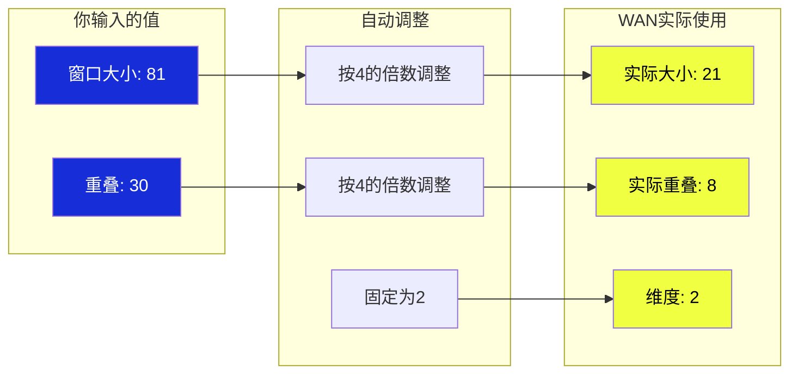
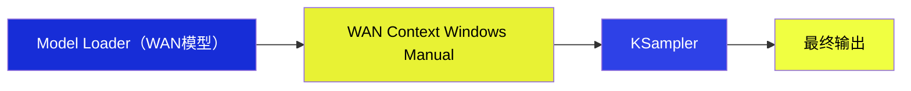

`WAN Context Windows (Manual)` 节点专门为 WAN 模型设计。它会自动调整参数，让 WAN 模型能更好地处理长内容。

**作用方式：**
就像用多个分段的采样分别生成不同分段的视频，最后合成一个完整视频**
- 每个窗口看一部分（窗口处理）
- 窗口之间有重叠确保连贯（重叠区域）
- 最后将所有部分拼接成完整的图像（结果融合）

```mermaid
%%{init: {"theme": "base", "themeVariables": {"primaryColor": "#444444", "primaryTextColor": "#ffffff", "primaryBorderColor": "#cccccc", "lineColor": "transparent", "sectionBkgColor": "#f8f9fa", "altSectionBkgColor": "#e9ecef", "gridColor": "transparent", "section0": "#555555", "section1": "#777777", "section2": "#E6F3FF", "section3": "#bbbbbb", "activeTaskBkgColor": "#444444", "activeTaskBorderColor": "#cccccc", "cScale0": "#555555", "cScale1": "#777777", "cScale2": "#E6F3FF", "critBkgColor": "#E6F3FF", "critBorderColor": "#B3D9FF", "xyColor": "#333333", "axisTextColor": "#333333", "gridLineColor": "transparent"}}}%%
gantt
    title 上下文窗口处理示例 (length=21, overlap=5)
    dateFormat X
    axisFormat %s
    
    section 原始序列
    完整内容 (长度81) : 0, 81
    
    section 窗口处理
    窗口1 (0-20) : active, w1, 0, 21
    窗口2 (16-36) : active, w2, 16, 37
    窗口3 (32-52) : active, w3, 32, 53
    窗口4 (48-68) : active, w4, 48, 69
    窗口5 (64-81) : active, w5, 64, 81
    
    section 重叠区域
    重叠1-2 : crit, o1, 16, 21
    重叠2-3 : crit, o2, 32, 37
    重叠3-4 : crit, o3, 48, 53
    重叠4-5 : crit, o4, 64, 69
```

## 输入参数

| 参数名称 | 功能说明 | 简单解释 |
|---------|----------|----------|
| `model` | WAN 模型输入 | 你要处理的 WAN 模型 |
| `context_length` | 窗口大小 | 每个小窗口的长度，WAN 会自动按 4 的倍数调整。越大处理范围越广但占用内存更多 |
| `context_overlap` | 重叠大小 | 窗口之间重叠的部分，重叠越多效果越平滑但处理越慢 |
| `context_schedule` | 处理方式 | 选择窗口如何移动，有四种模式可选 |
| `context_stride` | 移动步长 | 窗口每次移动多少，只在均匀模式下有用 |
| `closed_loop` | 循环模式 | 是否让最后一个窗口连回第一个，只在循环模式下有用 |
| `fuse_method` | 合并方法 | 选择重叠部分如何合并，影响最终效果 |
| `dim` | 处理维度 | 固定为 2，专门为 WAN 模型优化 |

### 调度策略选择

| 调度策略 | 工作方式 |
|---------|----------|
| **STATIC_STANDARD** | 窗口位置固定 |
| **UNIFORM_STANDARD** | 窗口均匀移动 |
| **UNIFORM_LOOPED** | 窗口循环移动 |
| **BATCHED** | 多个窗口同时处理 |

### 合并方法

| 合并方法 | 权重分布方式 | 特点 |
|---------|----------|----------|
| **PYRAMID** | 中间部分最重要，向两边递减 | 最自然的效果，推荐使用 |
| **RELATIVE** | 智能调整权重 | 根据位置自动调整，效果自然 |
| **FLAT** | 平均分配权重 | 简单直接，适合均匀内容 |
| **OVERLAP_LINEAR** | 线性渐变 | 过渡更平滑 |

## 输出结果

| 参数名称 | 数据类型 | 说明 |
|---------|---------|------|
| `model` | MODEL | 处理好的 WAN 模型，可以直接连接到采样器使用 |

### WAN 参数自动调整

## 典型用法

**使用步骤**：
1. 加载 WAN 模型
2. 连到 WAN Context Windows Manual 节点  
3. 连到采样器生成结果