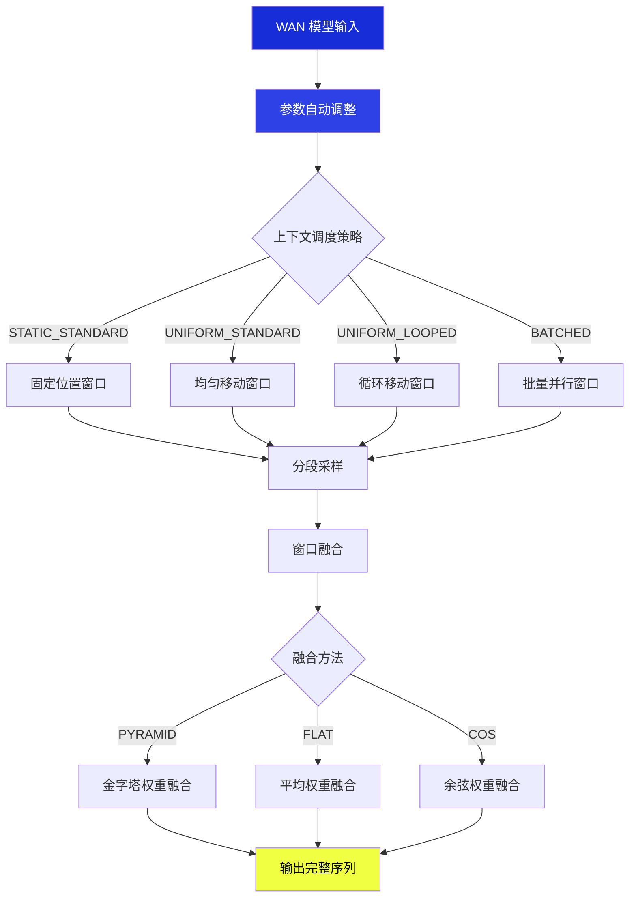
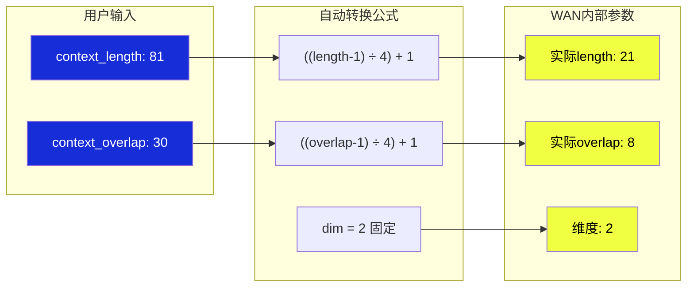

`WAN Context Windows (Manual)` 节点是专门为 WAN (Wide Attention Network) 模型设计的上下文窗口控制器。它自动将用户友好的上下文参数转换为 WAN 模型所需的内部格式，实现高效的滑动窗口采样，特别适用于长序列生成任务。

```mermaid
%%{init: {"theme": "base", "themeVariables": {"primaryColor": "#444444", "primaryTextColor": "#ffffff", "primaryBorderColor": "#cccccc", "lineColor": "transparent", "sectionBkgColor": "#f8f9fa", "altSectionBkgColor": "#e9ecef", "gridColor": "transparent", "section0": "#555555", "section1": "#777777", "section2": "#E6F3FF", "section3": "#bbbbbb", "activeTaskBkgColor": "#444444", "activeTaskBorderColor": "#cccccc", "cScale0": "#555555", "cScale1": "#777777", "cScale2": "#E6F3FF", "critBkgColor": "#E6F3FF", "critBorderColor": "#B3D9FF", "xyColor": "#333333", "axisTextColor": "#333333", "gridLineColor": "transparent"}}}%%
gantt
    title WAN 上下文窗口处理示例 (length=21, overlap=8)
    dateFormat X
    axisFormat %s
    
    section 原始序列
    完整内容 (长度100) : 0, 81
    
    section 窗口划分
    窗口1 (0-20) : active, window1, 0, 21
    窗口2 (13-33) : active, window2, 13, 34
    窗口3 (26-46) : active, window3, 26, 47
    窗口4 (39-59) : active, window4, 39, 60
    
    section 重叠区域
    重叠1-2 : crit, overlap1, 13, 21
    重叠2-3 : crit, overlap2, 26, 34
    重叠3-4 : crit, overlap3, 39, 47
```

## 输入参数详解

| 参数名称 | 功能说明 | 详细解释 |
|---------|----------|----------|
| `model` | WAN 模型输入 | 需要应用上下文窗口处理的 WAN 模型对象 |
| `context_length` | 窗口长度控制 | 每个上下文窗口的长度，WAN 模型会自动按 4 的倍数调整。值越大处理范围越广但显存占用更高 |
| `context_overlap` | 窗口重叠设置 | 相邻窗口间的重叠区域大小，确保窗口间内容连贯性。重叠越多越平滑但处理时间更长 |
| `context_schedule` | 调度策略选择 | 控制窗口如何在序列上移动和排布，包括静态、均匀、循环、批处理四种模式 |
| `context_stride` | 移动步长 | 窗口每次移动的步长大小，仅在 UNIFORM 调度模式下生效，控制窗口移动的精细程度 |
| `closed_loop` | 循环模式开关 | 是否将最后一个窗口与第一个窗口连接形成循环，仅在 LOOPED 调度模式下生效 |
| `fuse_method` | 融合方法 | 决定重叠区域如何合并的算法，影响窗口间过渡的平滑程度和最终效果 |

### 上下文调度策略详解

| 调度策略 | 工作方式 | 最佳使用场景 |
|---------|----------|-------------|
| **STATIC_STANDARD** | 窗口位置固定不动 | 处理固定区域内容，需要精确控制位置的任务 |
| **UNIFORM_STANDARD** | 窗口按设定步长均匀移动 | 长序列的连续处理，如长文本或长视频序列 |
| **UNIFORM_LOOPED** | 均匀移动并首尾相连 | 循环内容处理，如背景音乐、重复图案生成 |
| **BATCHED** | 多个窗口并行批处理 | 大量数据的高效处理，适合显存充足的情况 |

### 融合方法详解

| 融合方法 | 权重分布方式 | 效果特点 |
|---------|-------------|----------|
| **PYRAMID** | 中心区域权重最高，向边缘递减 | 最自然的过渡效果，推荐大多数场景使用 |
| **FLAT** | 重叠区域平均分配权重 | 简单直接的融合，适合均匀内容 |
| **COS** | 余弦曲线形状的权重分布 | 非常平滑的过渡，适合需要柔和效果的内容 |

## 输出结果

| 参数名称 | 数据类型 | 说明 |
|---------|---------|------|
| `model` | MODEL | 应用了上下文窗口处理的 WAN 模型对象 |

## 节点原理：电影制作的分镜头策略

想象你要拍摄一部超长的全景电影，但摄像机的视野有限。`WAN Context Windows (Manual)` 就像是**专业的分镜头导演**：

### 工作流程图

### WAN 参数自动转换

### 简单理解

`WAN Context Windows (Manual)` 就像用多个小镜头拍摄一部长电影：
- 每个镜头拍摄一小段内容（窗口处理）
- 镜头之间有重叠确保连贯性（窗口重叠）
- 最后将所有镜头智能拼接成完整影片（融合输出）

## 推荐配置

**新手推荐**：保持默认值即可（length: 81, overlap: 30）

**需要更高质量**：增加重叠值到 40-50

**处理超长内容**：增加窗口长度到 100-150

## 性能与限制

### 优势
- ✅ **显存友好**：分段处理避免大显存需求
- ✅ **WAN 优化**：专门为 WAN 模型调优
- ✅ **参数自动调整**：无需手动计算转换
- ✅ **多种策略**：灵活的调度和融合选项

### 注意事项
- ⚠️ 处理时间会比普通方式稍长
- ⚠️ 需要更多显存来存储窗口信息

## 典型用法

**使用步骤**：
1. 加载 WAN 模型
2. 连接到 WAN Context Windows Manual 节点  
3. 连接到采样器生成结果

通过 `WAN Context Windows (Manual)` 节点，您可以轻松处理长序列生成任务，无需担心显存限制。