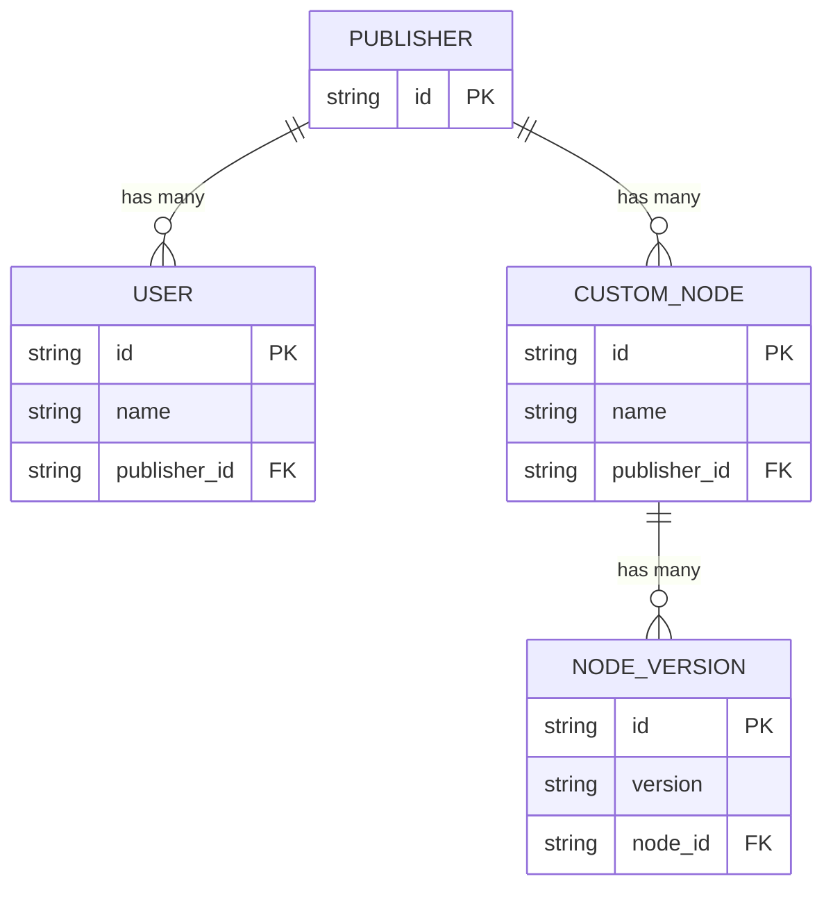

## 概览

自定义节点注册表遵循以下结构：

## 常用 API

- **列出所有节点** [API](/zh-CN/registry/api-reference/nodes/retrieves-a-list-of-nodes)
- **安装节点** [API](/zh-CN/registry/api-reference/nodes/returns-a-node-version-to-be-installed)
