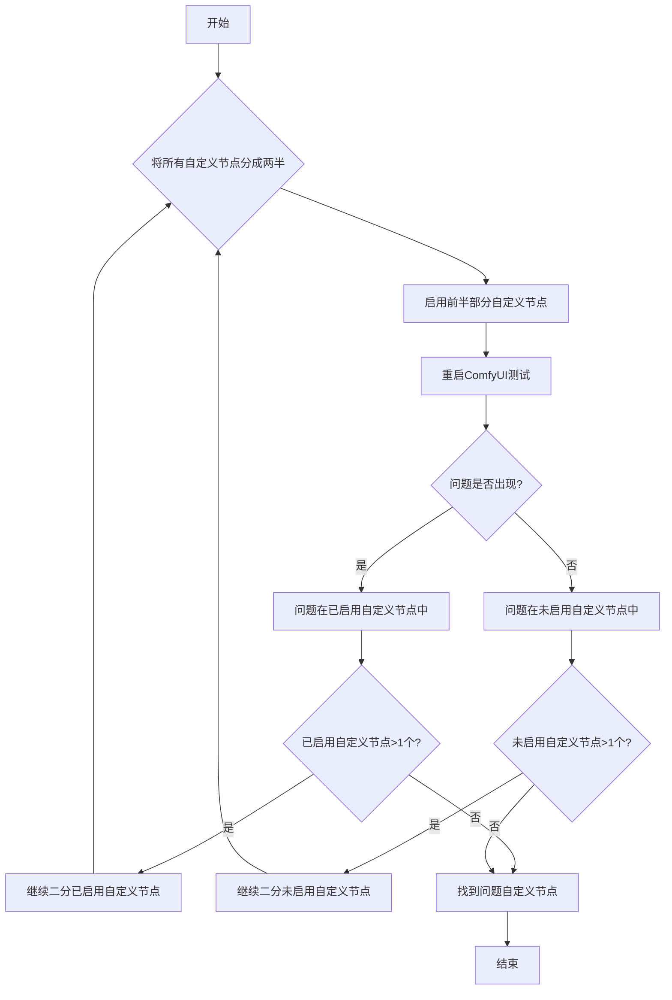

关于自定义节点问题排查，本篇文档的总体思路如下：

 ```mermaid
 flowchart TD
    A[遇到问题] --> B{<a href="#如何禁用所有的自定义节点？">禁用所有自定义节点后问题是否消失？</a>}
    B -- 是 --> C[问题由自定义节点引起]
    B -- 否 --> D[问题不是自定义节点引起，参考其他<a href="/zh-CN/troubleshooting/overview">排查文档</a>]
    C --> E{是否先排查前端扩展？}
    E -- 是 --> F[在<a href="#1-排查自定义节点的前端扩展">ComfyUI前端</a>进行排查<br/><li>仅需要重载前端</li>]
    E -- 否 --> G[使用<a href="#2-通用的自定义节点排查方法">通用的二分法</a>进行排查<br/><li>需要多次重启 ComfyUI</li>]
    F --> H[使用二分法定位有问题的节点]
    G --> H
    H --> I[<a href="#修复自定义节点问题">修复、替换、报告或移除有问题的节点</a>]
    I --> J[问题解决]
```

## 如何禁用所有的自定义节点？

<Tabs>
   <Tab title="桌面版">
   从设置菜单中启动禁用自定义节点的 ComfyUI 桌面版
   
   或手动运行服务器：
   ```bash
   cd path/to/your/comfyui
   python main.py --disable-all-custom-nodes
   ```
   </Tab>
   <Tab title="手动安装">
   ```bash
   cd ComfyUI
   python main.py --disable-all-custom-nodes
   ```
   </Tab>
   <Tab title="便携版">
   <Tabs>
      <Tab title="修改 `.bat` 文件（推荐）">
      打开便携版所在的文件夹，找到 `run_nvidia_gpu.bat` 或者 `run_cpu.bat` 文件
      
      1. 复制 `run_nvidia_gpu.bat` 或者 `run_cpu.bat` 文件并重命名为 `run_nvidia_gpu_disable_custom_nodes.bat` 
      2. 使用记事本打开复制后的文件
      3. 在文件中添加 `--disable-all-custom-nodes` 参数，或者复制下面的参数保存到 txt 文件中后将文件后缀名改为 `.bat`
      ```bash
      .\python_embeded\python.exe -s ComfyUI\main.py --disable-all-custom-nodes  --windows-standalone-build
      pause
      ```
      4. 保存文件并关闭
      5. 双击运行文件，如果一切正常，你应该会看到 ComfyUI 启动，并且自定义节点被禁用
      </Tab>
      <Tab title="通过命令行">
      
      1. 进入便携版所在的文件夹
      2. 通过右键菜单 → 打开终端 来打开命令行
   
   
      3. 确保在命令行中文件夹名称是当前便携版所在的文件目录
      4. 输入以下命令,来通过便携版的 python 来启动 ComfyUI 并禁用自定义节点
      ```
      .\python_embeded\python.exe -s ComfyUI\main.py --disable-all-custom-nodes
      ```
      </Tab>
   </Tabs>
   </Tab>
</Tabs>
**结果：**
- ✅ **问题消失**：自定义节点导致问题 → 继续步骤 2
- ❌ **问题仍然存在**：不是自定义节点问题 → [报告问题](#报告问题)


## 二分法

在本篇中我们将会介绍使用二分搜索来进行自定义节点问题排查的思路，也就是一次排查一半的自定义节点，直到定位到导致问题的自定义节点

具体思路清参考下面的流程图，即每次启用所有未启用节点的一半，看看对应的问题是否出现，直到定位到对应的自定义节点是哪个



## 两种排查方法

在本篇文档中，我们将排查的自定义节点分为两类


- A:包含前端扩展的自定义节点
- B: 常规节点

首先让我们先了解不同类型的自定义节点可能导致的问题和原因

<Tabs>
   <Tab title="自定义节点前端扩展导致的问题">
   对于自定义节点我们又特别需要对包含前端扩展的自定义节点进行优先排查，这类节点导致的问题是最多的, 他们主要的冲突是与 ComfyUI 前端版本更新产生的冲突。
   
   常见的一些问题有:
   - 工作流无法执行
   - 节点预览图丢失
   - UI元素错位
   - 无法进入 ComfyUI 前端
   - UI 完全损坏或显示空白屏幕
   - 无法和 ComfyUI 后端正常通信
   - 节点之间的连线无法正常工作
   - 等等
   
   常见这类节点导致的原因是因为：
   - 我们在对前端进行更新过程中进行了一些修改调整，这些自定义节点没有及时更新
   - 用户常常在更新过程中只是更新了 ComfyUI 并没有对自定义节点进行同步升级，虽然作者进行了更新，但是用户并没有在使用最新的兼容版本
   - 作者停止了维护，导致对应的自定义节点扩展无法和前端相互兼容
      
   </Tab>
   <Tab title="普通自定节点问题">
   如果问题不是由于自定义节点的前端扩展导致，那么更多会出现在依赖问题上，这类常见的问题会有：
   - 控制台/日志中出现"Failed to import"（导入失败）错误
   - 安装工作流缺失的节点后重启后任然显示丢失
   - ComfyUI 崩溃或无法启动
   - 等

   常见的这类错误导致的原因有：
   - 自定义节点还需要安装额外的 wheel 比如 ComfyUI-Nunchaku
   - 自定义使用了严格的依赖版本比如 `torch==2.4.1` 但是其它插件使用的是  `torch>=2.4.2` 在安装对应自定义节点以后后另外一个节点的依赖就冲突了
   - 网络问题导致的对应依赖没有安装成功

   如果问题发生在 python 环境的相互依赖上，版本等，这类问题处理起来需要一定的 python 环境知识，需要懂得如何在 python 环境中进行依赖的安装和卸载，这类问题处理起来会相对复杂一些
   </Tab>
</Tabs>

## 使用二分法进行排查

这两种上面两种不同的自定义节点问题里，自定义节点前端扩展和 ComfyUI 的冲突较为常见，我们会优先排查这类节点，后续的整体的问题排查思路如下

### 1.排查自定义节点的前端扩展

<Steps>
   <Step title="禁用所有插件的前端扩展">
   
   在启动 ComfyUI 后，在设置菜单中找到 `扩展` 菜单，并参考上图步骤禁用所有第三方扩展
   </Step>
   <Step title="重启一次 ComfyUI">
   在首次禁用前端扩展后，建议重启一次 ComfyUI 来保证能够顺利地禁用所有的前端扩展加载
   - 如果问题消失，那么问题就是由自定义节点的前端扩展引起的，我们可以继续进行下一步进行二分法进行排查
   - 如果问题仍然存在，那么问题就不是由自定义节点的前端扩展引起的，请参考本文另外一部分自定义节点扩展问题排查的思路
   </Step>
   <Step title="使用二分搜索定位问题节点">
   使用本文开头提到的方法来进行问题排查，一次启用一半的自定义节点，直到找到导致问题的自定义节点
   
   参考图片，对一半的前端扩展进行启用，另外如果对应的扩展名称都相似，那么说明他们是来自同一个自定义节点的前端扩展
   </Step>
   <Step title="后续处理">
   如果找到问题自定义节点请参考本文的问题修复部分来进行自定义节点的问题修复
   </Step>
</Steps>

使用这种方法，你不用多次重启 ComfyUI 仅需要在每次启用 / 禁用自定义节点的前端扩展后重载 ComfyUI 即可, 而且你的排查范围也只是在有前端扩展的节点里，会大大缩小节点排查范围

### 2. 通用的自定义节点排查方法

<Steps>
   <Step title="使用二分搜索定位自定义节点">
      对于二分搜索定位的方法，除了手动之外我们也有使用 comfy-cli 来进行自动化的二分搜索，具体方法如下：

      <Tabs>
         <Tab title="使用 Comfy CLI（推荐）">
         使用 Comfy CLI 需要你具有一定的命令行使用经验，如果你对此不擅长，请使用手动二分搜索
         
         如果你已安装 [Comfy CLI](/zh-CN/comfy-cli/getting-started)，那么 Comfy CLI 可以允许你使用自动化的二分工具来找到有问题的节点：

         ```bash
         # 开始二分会话
         comfy-cli node bisect start

         # 按照提示操作：
         # - 使用当前启用的节点集测试 ComfyUI
         # - 如果问题消失，标记为 'good'：comfy-cli node bisect good
         # - 如果问题仍然存在，标记为 'bad'：comfy-cli node bisect bad
         # - 重复直到识别出有问题的节点

         # 完成后重置
         comfy-cli node bisect reset
         ```

         二分工具将自动启用/禁用节点并引导你完成整个过程。
         </Tab>
         <Tab title="手动二分搜索">
            <Warning>
            开始之前，请**创建备份**你的 custom_nodes 文件夹，以防出现问题。
            </Warning>

            如果你更喜欢手动操作或没有安装 Comfy CLI，请按照以下步骤操作：
            <Steps>
               <Step title="创建临时文件夹">
                  在开始前先进入 `<你的安装位置>\ComfyUI\` 文件夹
                  <Tabs>
                     <Tab title="Windows">
                     - **备份所有自定义节点**: 将 `custom_nodes` 复制并重命名为 `custom_nodes_backup`
                     - **创建临时文件夹**: 创建一个名为 `custom_nodes_temp` 的文件夹
                     
                     或者使用下面的命令行来进行备份
      
                     ```bash
                     # 创建备份和临时文件夹
                     mkdir "%USERPROFILE%\custom_nodes_backup"
                     mkdir "%USERPROFILE%\custom_nodes_temp"

                     # 首先备份所有内容
                     xcopy "custom_nodes\*" "%USERPROFILE%\custom_nodes_backup\" /E /H /Y
                     ```
                     </Tab>
                     <Tab title="macOS/Linux">
                     手动备份 custom_nodes 文件夹
                     或使用下面的命令行来进行备份
                     ```bash
                     # 创建备份和临时文件夹
                     mkdir ~/custom_nodes_backup
                     mkdir ~/custom_nodes_temp

                     # 备份所有内容
                     cp -r custom_nodes/* ~/custom_nodes_backup/
                     ```
                     </Tab>
                     <Tab title="云端/Colab">
                     ```bash
                     # 创建备份和临时文件夹
                     mkdir /content/custom_nodes_backup
                     mkdir /content/custom_nodes_temp

                     # 首先备份所有内容
                     cp -r /content/ComfyUI/custom_nodes/* /content/custom_nodes_backup/
                     ```
                     </Tab>
                  </Tabs>
               </Step>
               <Step title="列出所有自定义节点">
                   <Tabs>
                     <Tab title="Windows">
                     由于 Windows 有可视化界面你可以忽略这一步，除非你只是使用命令行
                     ```bash
                     dir custom_nodes
                     ```
                     </Tab>
                     <Tab title="macOS/Linux">
                     ```bash
                     ls custom_nodes/
                     ```
                     </Tab>
                     <Tab title="云端/Colab">
                     ```bash
                     ls /content/ComfyUI/custom_nodes/
                     ```
                     </Tab>
                  </Tabs>
               </Step>
               <Step title="将节点分成两半">
                  假设你有 8 个自定义节点。将前一半移动到临时存储：
                  <Tabs>
                  <Tab title="Windows">
                  ```bash
                  # 将前一半（节点 1-4）移动到临时文件夹
                  move "custom_nodes\node1" "%USERPROFILE%\custom_nodes_temp\"
                  move "custom_nodes\node2" "%USERPROFILE%\custom_nodes_temp\"
                  move "custom_nodes\node3" "%USERPROFILE%\custom_nodes_temp\"
                  move "custom_nodes\node4" "%USERPROFILE%\custom_nodes_temp\"
                  ```
                  </Tab>
                  <Tab title="macOS/Linux">
                  ```bash
                  # 将前一半（节点 1-4）移动到临时文件夹
                  mv custom_nodes/node1 ~/custom_nodes_temp/
                  mv custom_nodes/node2 ~/custom_nodes_temp/
                  mv custom_nodes/node3 ~/custom_nodes_temp/
                  mv custom_nodes/node4 ~/custom_nodes_temp/
                  ```
                  </Tab>
                  <Tab title="云端/Colab">
                  ```bash
                  # 将前一半（节点 1-4）移动到临时文件夹
                  mv /content/ComfyUI/custom_nodes/node1 /content/custom_nodes_temp/
                  mv /content/ComfyUI/custom_nodes/node2 /content/custom_nodes_temp/
                  mv /content/ComfyUI/custom_nodes/node3 /content/custom_nodes_temp/
                  mv /content/ComfyUI/custom_nodes/node4 /content/custom_nodes_temp/
                  ```
                  </Tab>
                  </Tabs>
               </Step>
               <Step title="测试 ComfyUI">
               正常启动 ComfyUI
                  ```bash
                  python main.py
                  ```
               </Step>
               <Step title="解释结果">
                  - **问题仍然存在**：问题在剩余节点（5-8）中
                  - **问题消失**：问题在移动的节点（1-4）中
               </Step>
               <Step title="缩小范围">
                  - 如果问题仍然存在：将剩余节点的一半（例如节点 7-8）移动到临时文件夹
                  - 如果问题消失：将临时节点的一半（例如节点 3-4）移回 custom_nodes
               </Step>
               <Step title="重复直到找到单个有问题的节点">
                  - 重复直到找到单个有问题的节点
               </Step>
            </Steps>
         </Tab>
      </Tabs>
   </Step>
</Steps>

## 修复自定义节点问题

一旦你识别出有问题的自定义节点：

### 选项 1:更新节点
1. 检查 ComfyUI 管理器中是否有可用更新
2. 更新节点并再次测试

### 选项 2:替换节点
1. 寻找具有类似功能的替代自定义节点
2. 查看 [ComfyUI 注册表](https://registry.comfy.org) 寻找替代方案

### 选项 3:报告问题
联系自定义节点开发者：
1. 找到节点的 GitHub 仓库
2. 创建问题并包含：
   - 你的 ComfyUI 版本
   - 错误消息/日志
   - 重现步骤
   - 你的操作系统

### 选项 4:移除节点
如果没有修复可用且你不需要该功能：
1. 从 `custom_nodes/` 中移除有问题的节点
2. 重启 ComfyUI

## 报告非自定义节点导致的问题

如果问题不是由自定义节点引起的，请参考通过[故障排除概述](/zh-CN/troubleshooting/overview)了解其他常见问题。

### 自定义节点特定问题
联系自定义节点开发者：
- 找到节点的 GitHub 仓库
- 创建问题并包含你的 ComfyUI 版本、错误消息、重现步骤和操作系统
- 查看节点文档了解已知问题

### ComfyUI 核心问题
- **GitHub**：[ComfyUI Issues](https://github.com/comfyanonymous/ComfyUI/issues)
- **论坛**：[官方 ComfyUI 论坛](https://forum.comfy.org/)

### 桌面应用问题  
- **GitHub**：[ComfyUI 桌面问题](https://github.com/Comfy-Org/desktop/issues)

### 前端问题
- **GitHub**：[ComfyUI 前端问题](https://github.com/Comfy-Org/ComfyUI_frontend/issues)

<Note>
对于一般安装、模型或性能问题，请参见我们的[故障排除概述](/zh-CN/troubleshooting/overview)和[模型问题](/zh-CN/troubleshooting/model-issues)页面。
</Note>