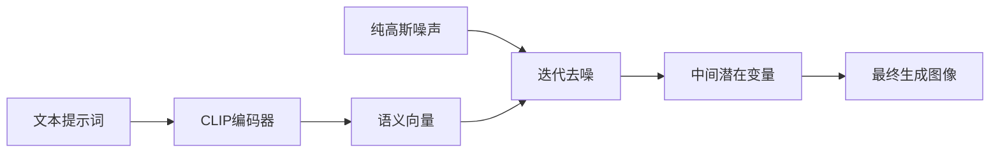
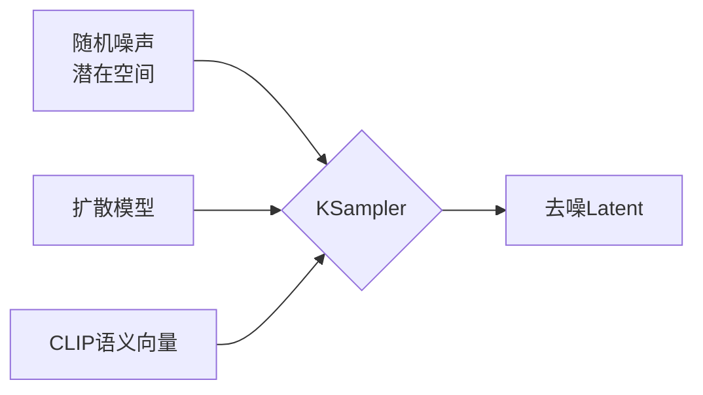

import InstallationModels from '/snippets/zh/tutorials/basic/installation-models.mdx'

本篇目的主要带你初步了解 ComfyUI 的文生图的工作流，并初步了解一些 ComfyUI 相关节点的功能和使用。

在本篇文档中我们将完成以下内容：
- 完成一次文生图工作流
- 简单了解扩散模型原理
- 了解工作流中的节点的功能和作用
- 初步了解 SD1.5 模型

我们将会先进行文生图工作流的运行，然后进行相关内容的讲解，请按你的需要选择对应部分开始。

## 关于文生图

**文生图(Text to Image)** ，是 AI 绘图中的基础流程，通过输入文本描述来生成对应的图片，它的核心是 **扩散模型**。

在文生图过程中我们需要以下条件：
- **画家：** 绘图模型
- **画布：** 潜在空间
- **对画面的要求（提示词）：**提示词，包括正向提示词（希望在画面中出现的元素）和负向提示词（不希望在画面中出现的元素）

这个文本到图片图片生成过程，可以简单理解成你把你的**绘图要求(正向提示词、负向提示词)**告诉一个**画家(绘图模型)**，画家会根据你的要求，画出你想要的内容。

## ComfyUI 文生图工作流示例讲解

### 1. 开始开始前的准备

<InstallationModels />

### 2. 加载文生图工作流

请下载下面的图片，并将图片拖入 ComfyUI 的界面中，或者使用菜单 **工作流（Workflows）** -> **打开（Open）** 打开这个图片以加载对应的 workflow


也可以从菜单 **工作流（Workflows）** -> **浏览工作流示例（Browse example workflows）** 中选择 **Text to Image** 工作流

### 3. 加载模型，并进行第一次图片生成

在完成了对应的绘图模型安装后，请参考下图步骤加载对应的模型，并进行第一次图片的生成


请对应图片序号，完成下面操作
1. 请在**Load Checkpoint** 节点使用箭头或者点击文本区域确保 **v1-5-pruned-emaonly-fp16.safetensors** 被选中，且左右切换箭头不会出现**null** 的文本
2. 点击 `Queue` 按钮，或者使用快捷键 `Ctrl + Enter(回车)` 来执行图片生成

等待对应流程执行完成后，你应该可以在界面的**保存图像（Save Image）**节点中看到对应的图片结果，可以在上面右键保存到本地


<Tip>如果生成结果不满意，可以多运行几次图片生成，因为每次运行图片生成，**KSampler** 根据 `seed` 参数会使用不同的随机种子，所以每次生成的结果都会有所不同</Tip>

### 4. 开始你的尝试

你可以尝试修改**CLIP Text Encoder**处的文本


其中连接到 KSampler 节点的`Positive`为正向提示词，连接到 KSampler 节点的`Negative`为负向提示词

下面是针对 SD1.5 模型的一些简单提示词原则
- 尽量使用英文
- 提示词之间使用英文逗号 `,` 隔开
- 尽量使用短语而不是长句子
- 使用更具体的描述
- 可以使用类似 `(golden hour:1.2)` 这样的表达来提升特定关键词的权重，这样它在画面中出现的概率会更高，`1.2` 为权重，`golden hour` 为关键词
- 可以使用类似 `masterpiece, best quality, 4k` 等关键词来提升生成质量

下面是几组不同的 prompt 示例，你可以尝试使用这些 prompt 来查看生成的效果，或者使用你自己的 prompt 来尝试生成

**1. 二次元动漫风格**

正向提示词：
```
anime style, 1girl with long pink hair, cherry blossom background, studio ghibli aesthetic, soft lighting, intricate details

masterpiece, best quality, 4k
```

负向提示词：
```
low quality, blurry, deformed hands, extra fingers
```

**2. 写实风格**

正向提示词：
```
(ultra realistic portrait:1.3), (elegant woman in crimson silk dress:1.2), 
full body, soft cinematic lighting, (golden hour:1.2), 
(fujifilm XT4:1.1), shallow depth of field, 
(skin texture details:1.3), (film grain:1.1), 
gentle wind flow, warm color grading, (perfect facial symmetry:1.3)
```

负向提示词：
```
(deformed, cartoon, anime, doll, plastic skin, overexposed, blurry, extra fingers)
```

**3. 特定艺术家风格**

正向提示词：
```
fantasy elf, detailed character, glowing magic, vibrant colors, long flowing hair, elegant armor, ethereal beauty, mystical forest, magical aura, high detail, soft lighting, fantasy portrait, Artgerm style
```

负向提示词：
```
blurry, low detail, cartoonish, unrealistic anatomy, out of focus, cluttered, flat lighting
```

## 文生图工作原理

整个文生图的过程，我们可以理解成是**扩散模型的反扩散过程**，我们下载的 [v1-5-pruned-emaonly-fp16.safetensors](https://huggingface.co/Comfy-Org/stable-diffusion-v1-5-archive/blob/main/v1-5-pruned-emaonly-fp16.safetensors) 是一个已经训练好的可以 **从纯高斯噪声生成目标图片的模型**，我们只需要输入我们的提示词，它就可以通随机的噪声降噪生成目标图片。



我们可能需要了解下两个概念，
1. **潜在空间：** 潜在空间（Latent Space）是扩散模型中的一种抽象数据表示方式，通过把图片从像素空间转换为潜在空间，可以减少图片的存储空间，并且可以更容易的进行扩散模型的训练和减少降噪的复杂度，就像建筑师设计建筑时使用蓝图（潜在空间）来进行设计，而不是直接在建筑上进行设计（像素空间），这种方式可以保持结构特征的同时，又大幅度降低修改成本
2. **像素空间：** 像素空间（Pixel Space）是图片的存储空间，就是我们最终看到的图片，用于存储图片的像素值。

如果你想要了解更多扩散模型相关内容，可以阅读下面的文章：
- [Denoising Diffusion Probabilistic Models (DDPM)](https://arxiv.org/pdf/2006.11239)
- [Denoising Diffusion Implicit Models (DDIM)](https://arxiv.org/pdf/2010.02502)
- [High-Resolution Image Synthesis with Latent Diffusion Models](https://arxiv.org/pdf/2112.10752)

## ComfyUI 文生图工作流节点讲解


### A. 加载模型（Load Checkpoint）节点


这个节点通常用于加载绘图模型, 通常 `checkpoint` 中会包含 `MODEL（UNet）`、`CLIP` 和 `VAE` 三个组件

- `MODEL（UNet）`：为对应模型的 UNet 模型, 负责扩散过程中的噪声预测和图像生成,驱动扩散过程
- `CLIP`：这个是文本编码器,因为模型并不能直接理解我们的文本提示词（prompt）,所以需要将我们的文本提示词（prompt）编码为向量,转换为模型可以理解的语义向量
- `VAE`：这个是变分自编码器,我们的扩散模型处理的是潜在空间,而我们的图片是像素空间,所以需要将图片转换为潜在空间,然后进行扩散,最后将潜在空间转换为图片

### B. 空Latent图像（Empty Latent Image）节点


定义一个潜在空间（Latent Space）,它输出到 KSampler 节点，空Latent图像节点构建的是一个 **纯噪声的潜在空间**

它的具体的作用你可以理解为定义画布尺寸的大小，也就是我们最终生成图片的尺寸

### C. CLIP文本编码器（CLIP Text Encoder）节点


用于编码提示词，也就是输入你对画面的要求
- 连接到 KSampler 节点的 `Positive` 条件输入的为正向提示词（希望在画面中出现的元素）
- 连接到 KSampler 节点的 `Negative` 条件输入的为负向提示词（不希望在画面中出现的元素）

对应的提示词被来自 `Load Checkpoint` 节点的 `CLIP` 组件编码为语义向量，然后作为条件输出到 KSampler 节点

### D. K 采样器（KSampler）节点


**K 采样器** 是整个工作流的核心，整个噪声降噪的过程都在这个节点中完成，并最后输出一个潜空间图像



KSampler 节点的参数说明如下

| 参数名称                  | 描述                                                               | 作用                                                            |
|--------------------------|-------------------------------------------------------------------|----------------------------------------------------------------|
| **model**                | 去噪使用的扩散模型                                                   | 决定生成图像的风格与质量                                           | 
| **positive**             | 正向提示词条件编码                                                   | 引导生成包含指定元素的内容                                         |
| **negative**             | 负向提示词条件编码                                                   | 抑制生成不期望的内容                                              | 
| **latent_image**         | 待去噪的潜在空间图像                                                 | 作为噪声初始化的输入载体                                           |
| **seed**                 | 噪声生成的随机种子                                                   | 控制生成结果的随机性                                              | 
| **control_after_generate** | 种子生成后控制模式                                                 | 决定多批次生成时种子的变化规律                                      |
| **steps**                | 去噪迭代步数                                                        | 步数越多细节越精细但耗时增加                                       | 
| **cfg**                  | 分类器自由引导系数                                                   | 控制提示词约束强度（过高导致过拟合）                                  |
| **sampler_name**         | 采样算法名称                                                        | 决定去噪路径的数学方法                                             | 
| **scheduler**            | 调度器类型                                                          | 控制噪声衰减速率与步长分配                                          | 
| **denoise**              | 降噪强度系数                                                        | 控制添加到潜在空间的噪声强度，0.0保留原始输入特征，1.0为完全的噪声               |

在 KSampler 节点中，潜在空间使用 `seed` 作为初始化参数构建随机的噪声,语义向量 `Positive` 和 `Negative` 会作为条件输入到扩散模型中

然后根据 `steps` 参数指定的去噪步数，进行去噪，每次去噪会根据 `denoise` 参数指定的降噪强度系数，对潜在空间进行降噪，并生成新的潜在空间图像

### E. VAE 解码（VAE Decode）节点


将 **K 采样器(KSampler)** 输出的潜在空间图像转换为像素空间图像

### F. 保存图像（Save Image）节点


预览并保存从潜空间解码的图像，并保存到本地`ComfyUI/output`文件夹下

## SD1.5 模型简介

**SD1.5(Stable Diffusion 1.5)** 是一个由[Stability AI](https://stability.ai/)开发的AI绘图模型，Stable Diffusion系列的基础版本，基于 **512×512** 分辨率图片训练，所以其对 **512×512** 分辨率图片生成支持较好，体积约为4GB，可以在**消费级显卡（如6GB显存）**上流畅运行。目前 SD1.5 的相关周边生态非常丰富，它支持广泛的插件（如ControlNet、LoRA）和优化工具。
作为AI绘画领域的里程碑模型，SD1.5凭借其开源特性、轻量架构和丰富生态，至今仍是最佳入门选择。尽管后续推出了SDXL/SD3等升级版本，但其在消费级硬件上的性价比仍无可替代。


### 基础信息
- **发布时间**：2022年10月
- **核心架构**：基于Latent Diffusion Model (LDM)
- **训练数据**：LAION-Aesthetics v2.5数据集（约5.9亿步训练）
- **开源特性**：完全开源模型/代码/训练数据

### 优缺点
模型优势：
- 轻量化：体积小，仅 4GB 左右，在消费级显卡上流畅运行
- 使用门槛低：支持广泛的插件和优化工具
- 生态成熟：支持广泛的插件和优化工具
- 生成速度快：在消费级显卡上流畅运行

模型局限：
- 细节处理：手部/复杂光影易畸变
- 分辨率限制：直接生成1024x1024质量下降
- 提示词依赖：需精确英文描述控制效果

