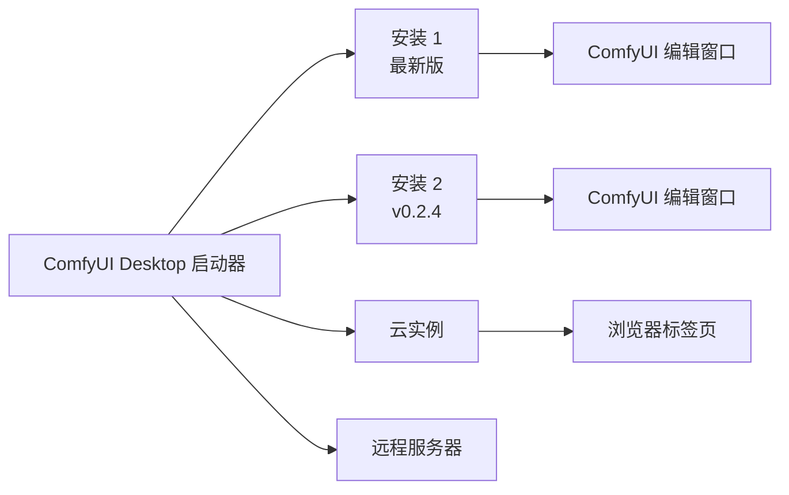

**ComfyUI Desktop** 是一款新一代桌面应用，让你从一个地方安装、管理和启动多个 ComfyUI 实例。不同于旧的 Desktop 版本（单一实例），ComfyUI Desktop 是一个多实例管理器——可以理解为一个启动所有 ComfyUI 环境的启动器。

## 主要功能

<CardGroup cols={2}>
  <Card title="多实例管理" icon="layer-group">
    同时管理多个 ComfyUI 版本。支持 **Standalone**（自带 Python）、**Cloud**、**Git Clone**、**Portable**（Windows）和**远程连接**。
  </Card>

  <Card title="快速安装" icon="bolt">
    一键安装全新的 ComfyUI，自动配置 Python 环境。
  </Card>

  <Card title="快照与恢复" icon="camera">
    每次更新前自动为你的自定义节点、模型和设置创建快照。随时恢复到任意之前的状态。
  </Card>

  <Card title="一键更新" icon="arrows-rotate">
    点击一次即可保持 ComfyUI 安装始终最新。
  </Card>

  <Card title="模型下载" icon="download">
    内置模型下载管理器，带进度跟踪。
  </Card>

</CardGroup>

## 工作原理

ComfyUI Desktop 将**启动器**与**工作流编辑器**分开。应用管理你的安装；每个安装运行自己的 ComfyUI 后端（和自己的 Python 环境）。当你启动一个安装时，它会在独立的窗口中打开完整的 ComfyUI 编辑器。

## 系统要求

<CardGroup cols={3}>
  <Card title="Windows" icon="windows">
    - **系统：** Windows 10 或更新
    - **GPU：** 支持 CUDA 的 NVIDIA GPU
    - **架构：** x64 或 ARM64
  </Card>

  <Card title="macOS" icon="apple">
    - **系统：** macOS 13 (Ventura) 或更新
    - **硬件：** Apple Silicon（M1 或更新）
  </Card>

  <Card title="Linux" icon="linux">
    - **系统：** Ubuntu 22.04+（基于 Debian）
    - **GPU：** 推荐支持 CUDA 的 NVIDIA GPU
  </Card>
</CardGroup>

### 通用要求
- **磁盘空间：** 每个独立安装至少 15 GB
- **内存：** 最低 8 GB，推荐 16 GB
- **网络：** 安装和更新需要联网

## 开源

ComfyUI Desktop 完全开源。在 [GitHub](https://github.com/Comfy-Org/Comfy-Desktop) 上查看源代码。

## 开始使用

选择你的平台开始：

<CardGroup cols={3}>
  <Card title="Windows" icon="windows" href="/zh/installation/desktop/windows">
    Windows 10 或更新版本安装 ComfyUI Desktop 的分步指南。
  </Card>

  <Card title="macOS" icon="apple" href="/zh/installation/desktop/macos">
    macOS 13+（Apple Silicon）安装 ComfyUI Desktop 的分步指南。
  </Card>

  <Card title="Linux" icon="linux" href="/zh/installation/desktop/linux">
    Ubuntu 22.04+ 安装 ComfyUI Desktop 的分步指南。
  </Card>
</CardGroup>

### 从旧版 Desktop 升级？

如果你在使用旧版 Desktop Legacy，请查看[迁移指南](/zh/installation/desktop/migrate-from-legacy)了解如何迁移。
