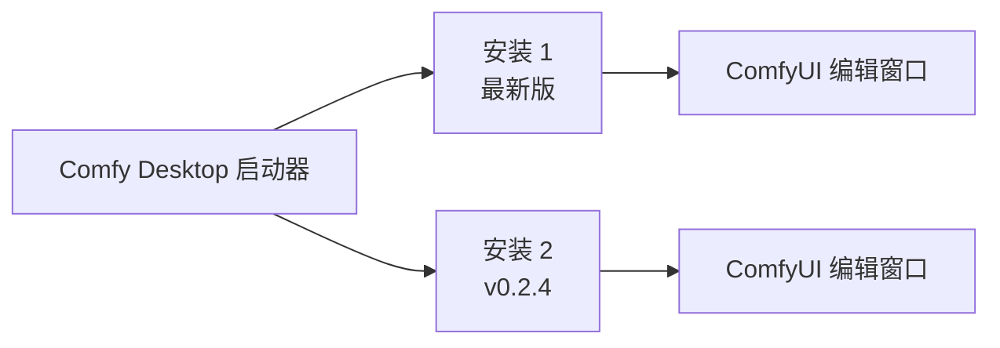

**Comfy Desktop** 是一款新一代桌面应用，让你从一个地方安装、管理和启动多个 ComfyUI 实例。不同于旧的 Desktop 版本（单一实例），Comfy Desktop 是一个多实例管理器——可以理解为一个启动所有 ComfyUI 环境的启动器。

## 主要功能

<CardGroup cols={2}>
  <Card title="多实例共存互不干扰" icon="layer-group">
    可运行任意数量的独立 ComfyUI 环境，每个拥有自己的版本、模型和自定义节点。切换安装无需担心冲突。
  </Card>

  <Card title="隔离的 GPU 就绪环境" icon="microchip">
    每个安装自带可迁移的 Python 环境，内含预构建的 PyTorch 和 GPU 依赖。安装时无需担心 pip 失败或 CUDA 版本问题。
  </Card>

  <Card title="一键更新" icon="arrows-rotate">
    原地更新 ComfyUI 和自定义节点到最新版本。无需终端、无需 Git、无需重新下载数 GB 的环境。
  </Card>

  <Card title="快照与回滚" icon="camera">
    备份安装状态，更新或自定义节点出问题时一键恢复。
  </Card>

  <Card title="导入现有安装" icon="folder-open">
    直接迁移现有的 ComfyUI 安装（便携版、Git 克隆或旧版 Desktop 安装）。
  </Card>

  <Card title="内置自动更新" icon="rotate">
    应用自动保持自身最新，无需手动检查新版本。
  </Card>
</CardGroup>

## 工作原理

Comfy Desktop 将**启动器**与**工作流编辑器**分开。应用管理你的安装；每个安装运行自己的 ComfyUI 后端（和自己的 Python 环境）。当你启动一个安装时，它会在独立的窗口中打开完整的 ComfyUI 编辑器。

## 系统要求

<CardGroup cols={3}>
  <Card title="Windows" icon="windows">
    - **系统：** Windows 10 或更新
    - **架构：** x64 或 ARM64
    - **GPU：** 推荐使用独立 GPU（NVIDIA / AMD），但不是必须
  </Card>

  <Card title="macOS" icon="app-store">
    - **系统：** macOS 13 (Ventura) 或更新
    - **硬件：** Apple Silicon（M1 或更新）
  </Card>

  <Card title="Linux" icon="linux">
    - **系统：** 基于 Debian（推荐 Ubuntu 22.04+）
    - **GPU：** 推荐使用独立 GPU（NVIDIA / AMD），但不是必须
  </Card>
</CardGroup>

### 通用要求
- **磁盘空间：** 每个独立安装至少 15 GB
- **内存：** 最低 8 GB，推荐 16 GB
- **网络：** 安装和更新需要联网

## 开源

Comfy Desktop 完全开源。在 [GitHub](https://github.com/Comfy-Org/Comfy-Desktop) 上查看源代码。

## 开始使用

选择你的平台开始：

<CardGroup cols={3}>
  <Card title="Windows" icon="windows" href="/zh/installation/desktop/windows">
    Windows 10 或更新版本安装 Comfy Desktop 的分步指南。
  </Card>

  <Card title="macOS" icon="app-store" href="/zh/installation/desktop/macos">
    macOS 13+（Apple Silicon）安装 Comfy Desktop 的分步指南。
  </Card>

  <Card title="Linux" icon="linux" href="/zh/installation/desktop/linux">
    基于 Debian 的发行版安装 Comfy Desktop 的分步指南。
  </Card>
</CardGroup>

### 从旧版 Desktop 升级？

如果你在使用旧版 Desktop Legacy，请查看[迁移指南](/zh/installation/desktop/migrate-from-legacy)了解如何迁移。
